## 1) Deploy a Windows and a Linux virtual machine (VM) in Azure
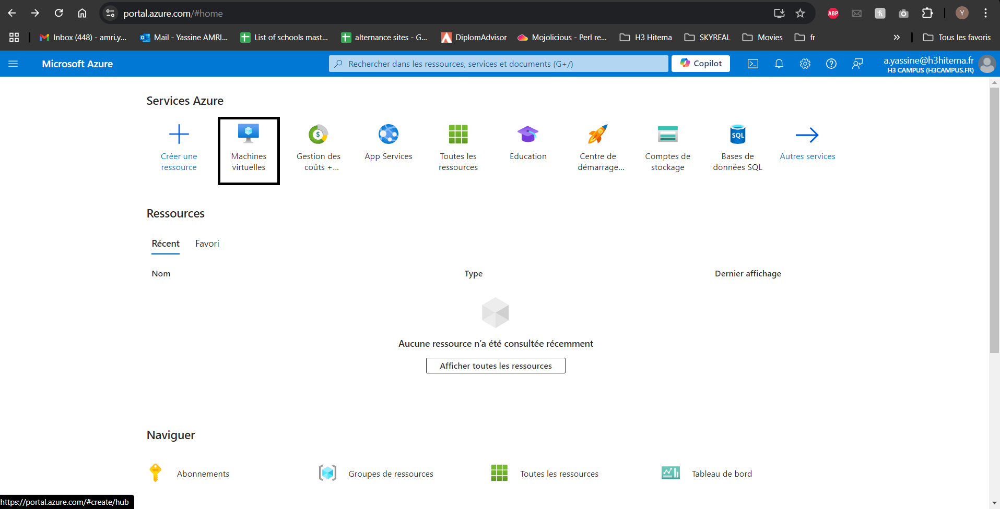
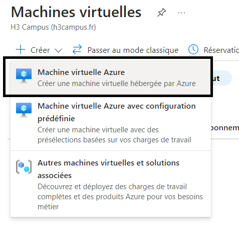
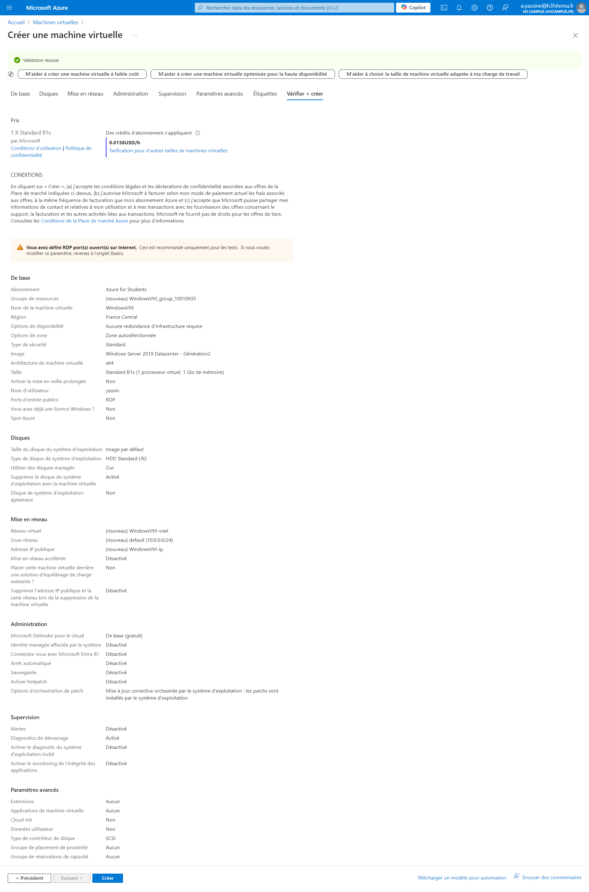
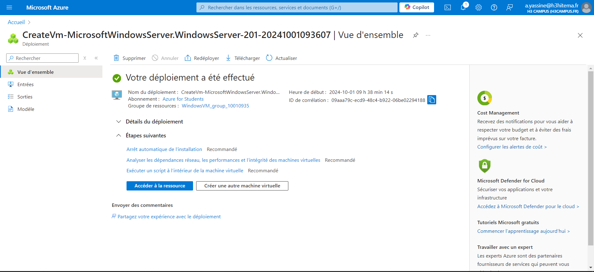
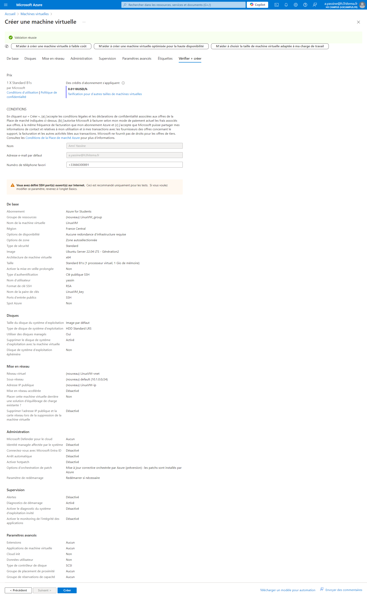
## 2) Configure VM sizes, storage options, and networking settings

## 3 Connect to the VMs using Remote Desktop Protocol (RDP) and Secure Shell (SSH)
#### a) Use RDP on windows
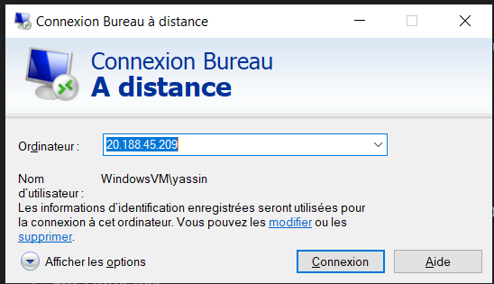
#### b) SSh with private key path
"C:\Users\Facto\.ssh\LinuxVM_key.pem"
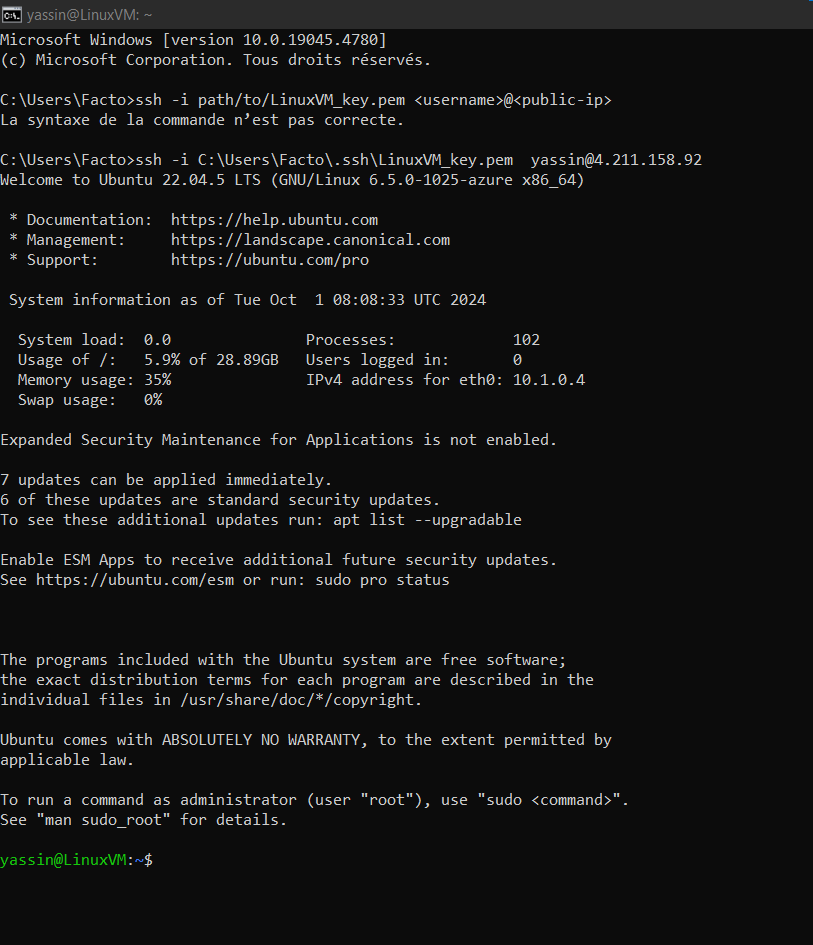
##  4) Install software on the VMs 
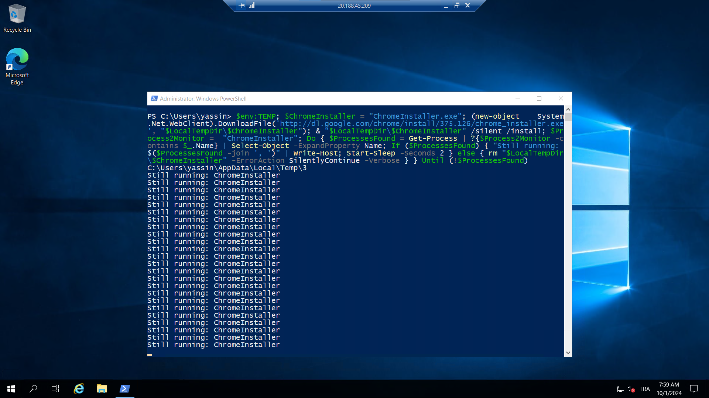
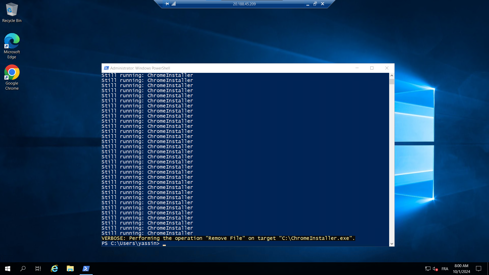
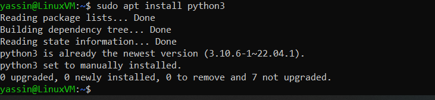
#### a)  take snapshots
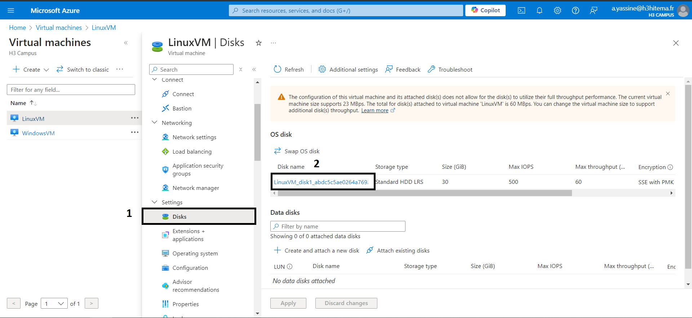
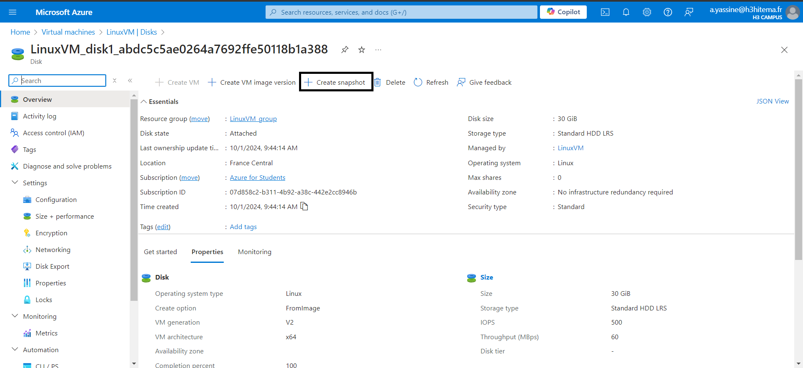
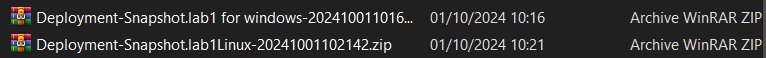