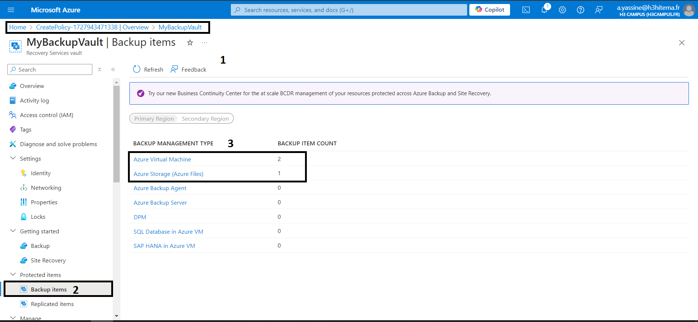

# 1) Create a Recovery Services Vault

# 2) Configure Backup for Virtual Machines

## a) Select Virtual Machines for Backup

## b) Configure Backup Policy

#### You can either use the default policy or create a new custom policy.

#### Default Policy:
- Backs up daily and retains daily recovery points for 30 days.

#### Custom Policy: 
- Set the Frequency (daily or weekly backups).

- Configure Retention settings (how long to keep daily, weekly, monthly, or yearly backups).

# 3) Configure Backup for Azure Files

## a) Create an Azure File Share

####  Go to Storage accounts and select an existing storage account or create a new one

#### Inside the storage account, click File shares and create a new file share.

#### Once the storage account is created, we can now create the file share

#### now we can upload our files to the backup of the fileshare

#### Don't forget to do an initial backup to be able to find the backup 

## b) Configure Backup for Azure Files

# 4) Perform a Backup and Restore Operation

## a) Perform a Backup

### all our backedup and protected items

## b) Restore Operation

# 5) Implement Backup Policies and Retention

## a) Modify or Create Backup Policies

## b) Assign Backup Policy

