# 1) Set Up Azure Monitor to Collect Metrics and Logs

#### We need to Create a Log Analytics Workspace if we don't have one

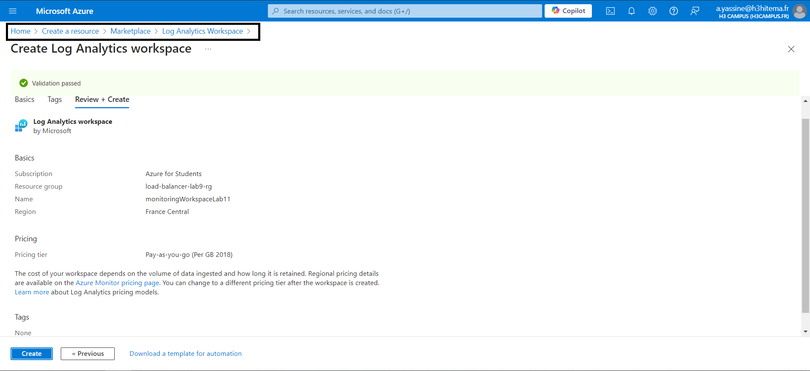

## a) Enable Diagnostics Settings for Resources

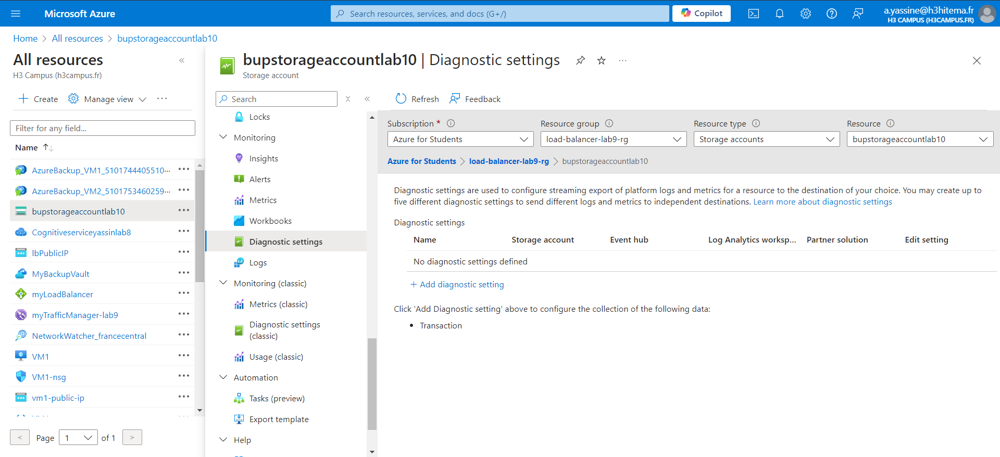

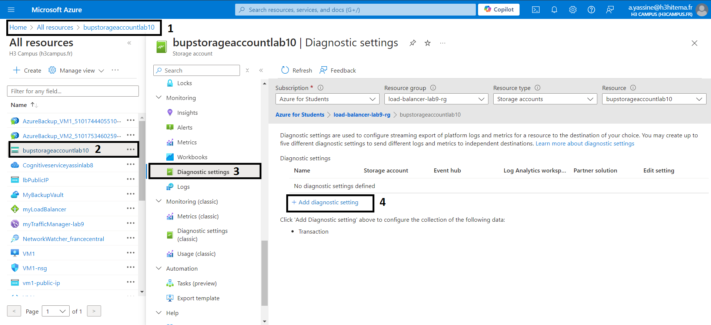

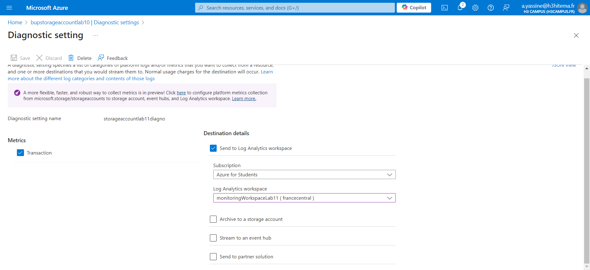

## b) Enable Metrics Collection

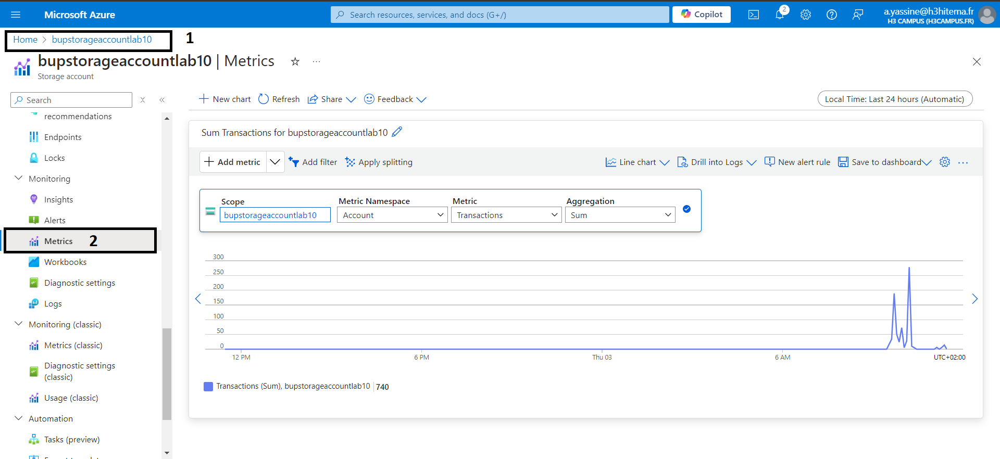

# 2) Create Alerts Based on Resource Metrics

## a)  Navigate to Alerts

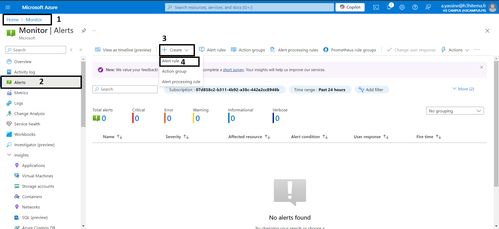

## b) Define the Alert Condition

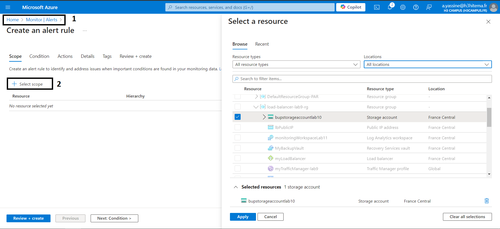

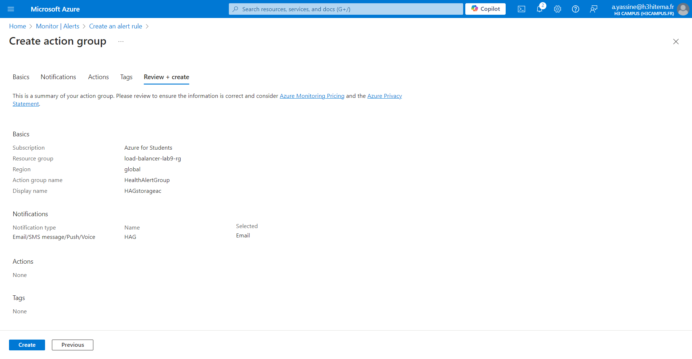

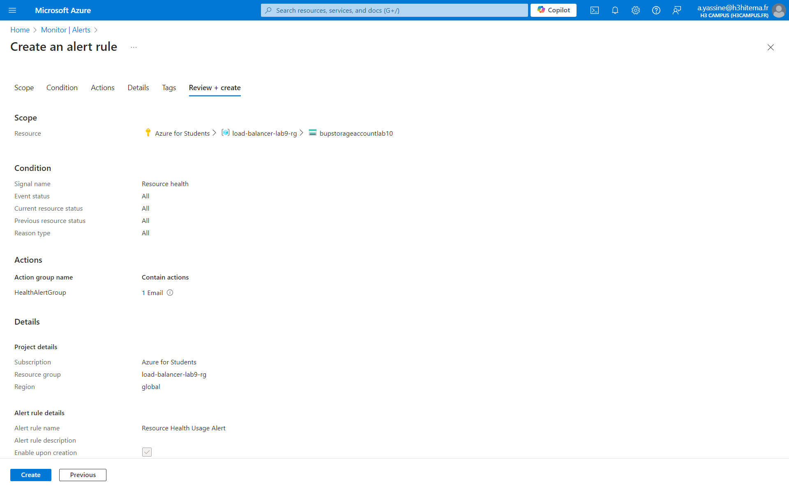

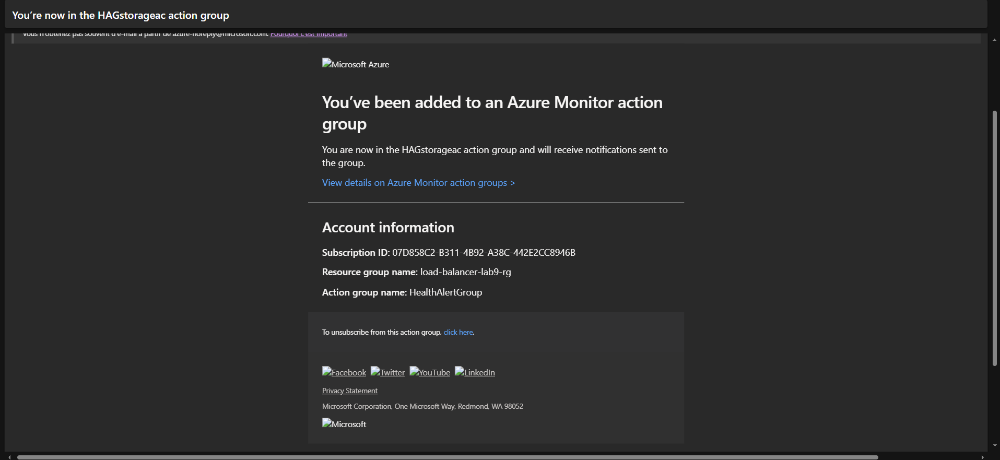

# 3) Visualize Data Using Azure Dashboards

## a) Create a Dashboard

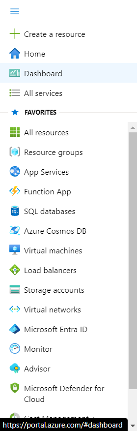

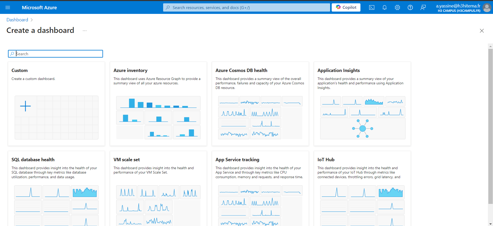

## b) Add Visualizations

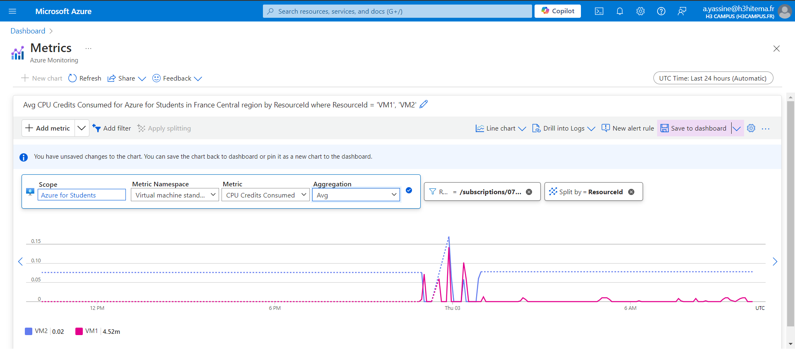

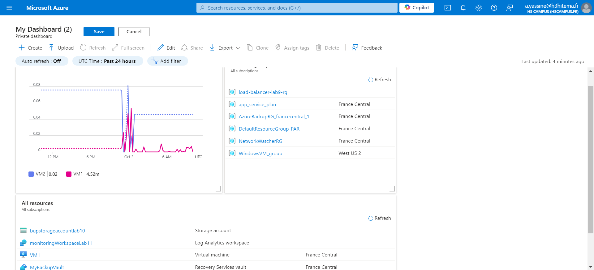

# 4) Implement Action Groups for Alert Notifications

## a) Create an Action Group

#### Action Groups allow you to configure notifications for alerts, which can be reused across multiple alert rules

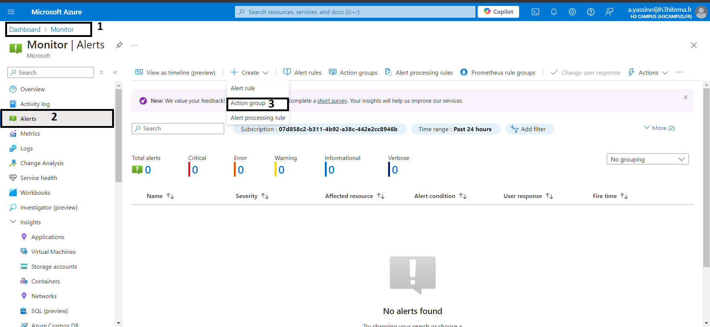

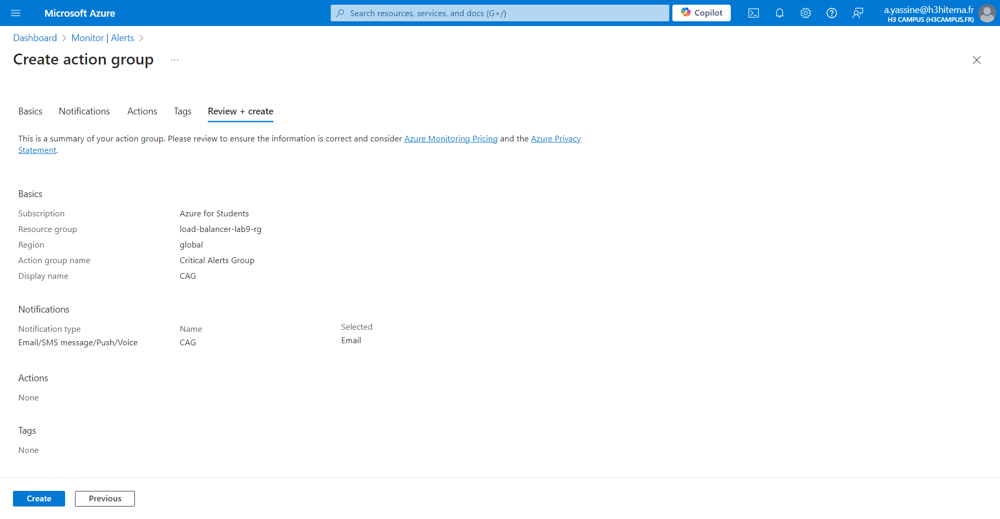

## b) Associate Action Groups with Alerts

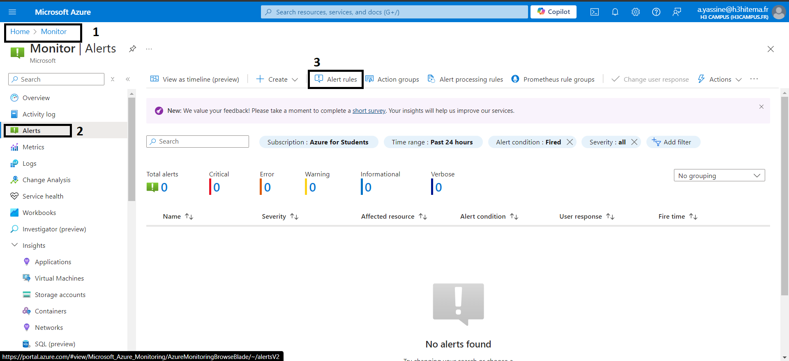

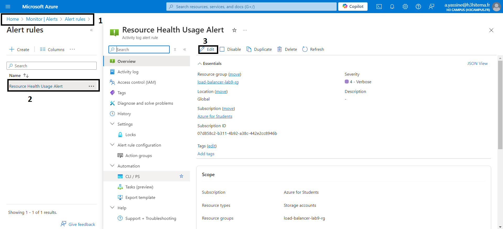

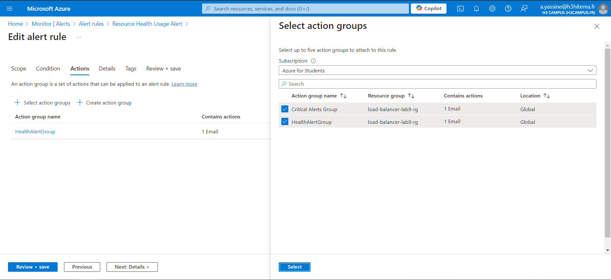

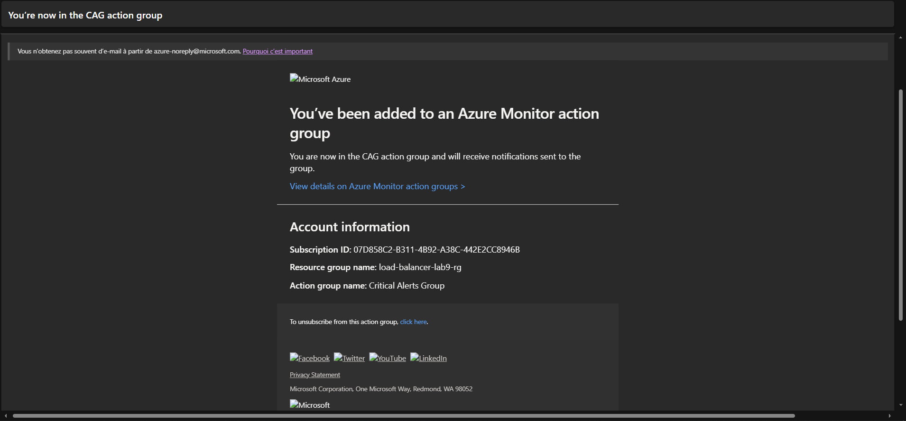