# 1) Create an Azure Key Vault

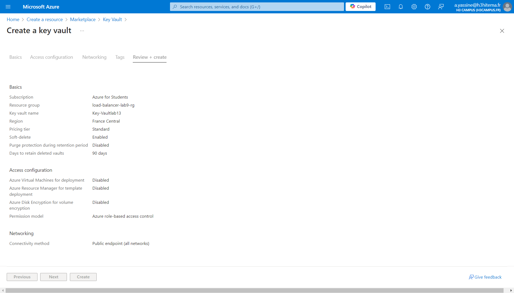

# 2) Store and Retrieve Secrets, Keys, and Certificates

## a) Store a Secret

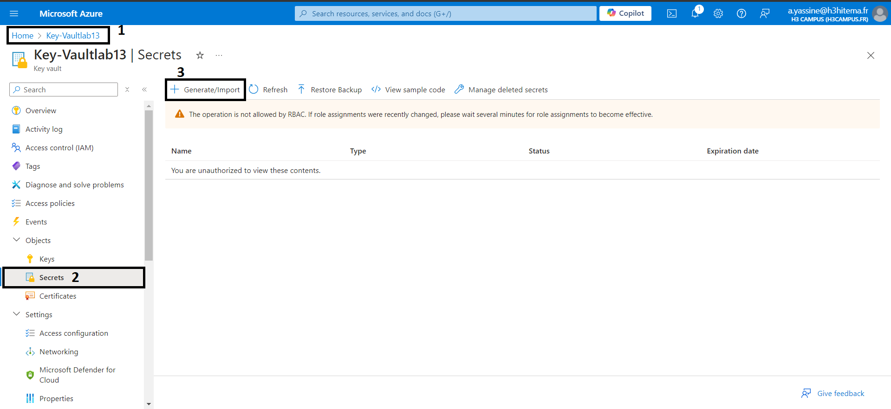

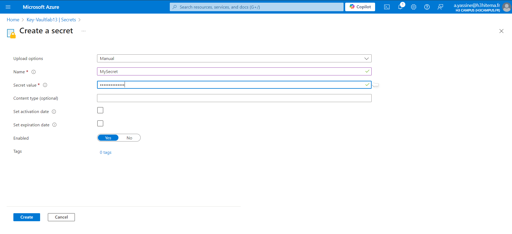

## b) Store a Keys

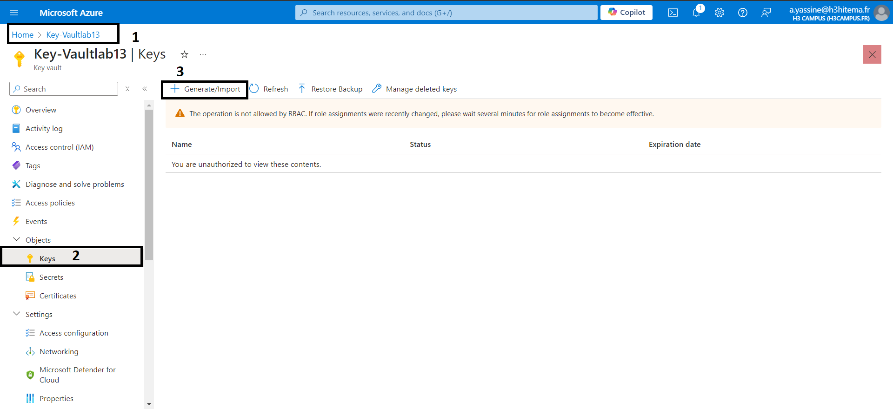

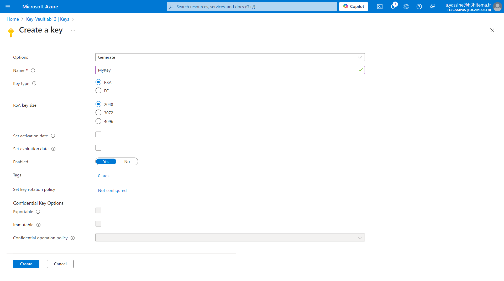

## c) Store a Certificates

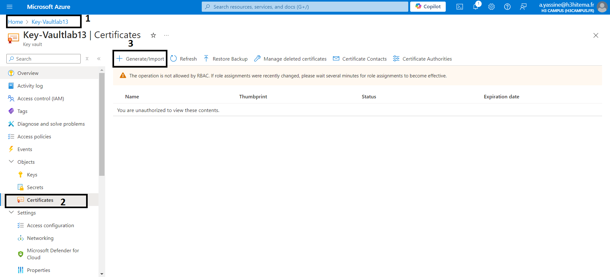

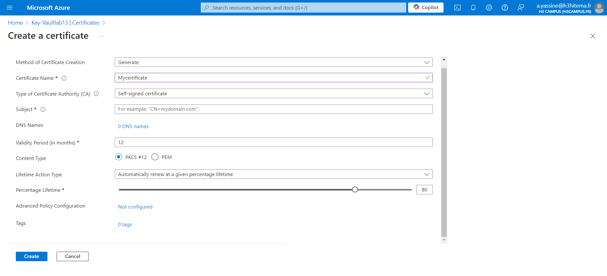

# 3) Integrate Key Vault with an Application

## a) Application Integration

#### If we are using an application, integrate the Key Vault by using the Azure SDK or REST API

#### code sample in a Node.js app to retrieve a secret from Key Vault

```
const { DefaultAzureCredential } = require('@azure/identity');
const { SecretClient } = require('@azure/keyvault-secrets');

const keyVaultName = 'your-key-vault-name';
const kvUri = `https://${keyVaultName}.vault.azure.net`;

const credential = new DefaultAzureCredential();
const client = new SecretClient(kvUri, credential);

async function getSecret() {
  const secret = await client.getSecret('MySecret');
  console.log(`Secret value: ${secret.value}`);
}

getSecret();

```

# 4) Set Up Access Policies and Monitoring

## a) Access Policies

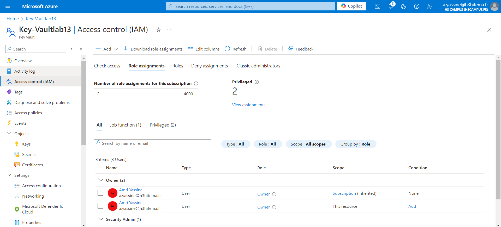

## b) Monitoring

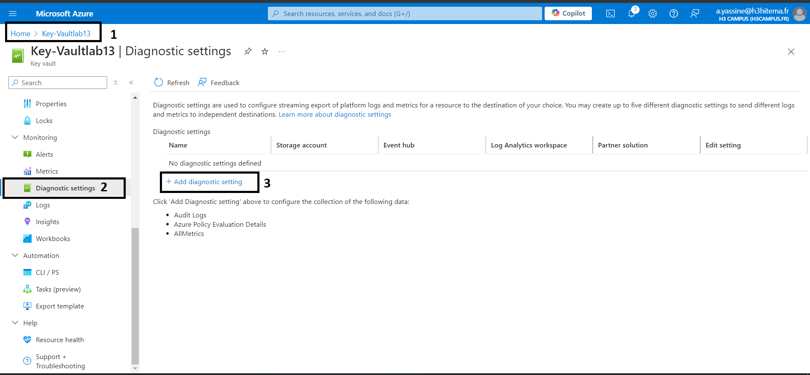

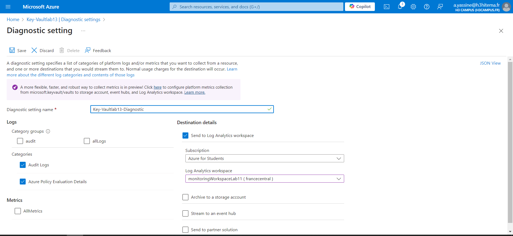

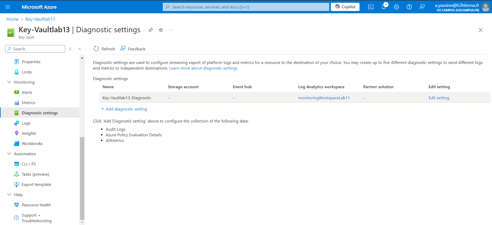

# 5) Use a Key Inside an Application

## a) Use the Key

#### In an application, you can use the keys stored in Azure Key Vault for cryptographic operations

"Example (using .NET SDK)"
```
using Azure.Identity;
using Azure.Security.KeyVault.Keys;
using Azure.Security.KeyVault.Keys.Cryptography;

var client = new CryptographyClient(new Uri($"https://{yourKeyVaultName}.vault.azure.net/keys/{keyName}"), new DefaultAzureCredential());

byte[] plaintext = Encoding.UTF8.GetBytes("Encrypt this data");
EncryptResult result = client.Encrypt(EncryptionAlgorithm.RsaOaep, plaintext);

Console.WriteLine($"Encrypted text: {Convert.ToBase64String(result.Ciphertext)}");

```
