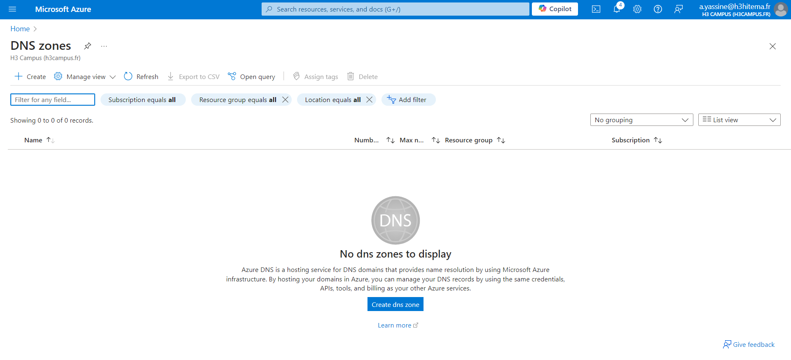
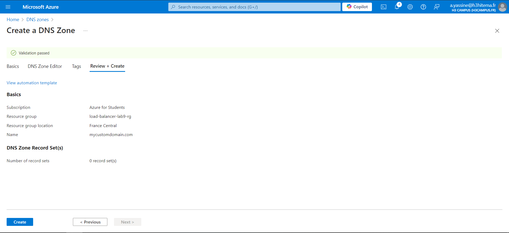
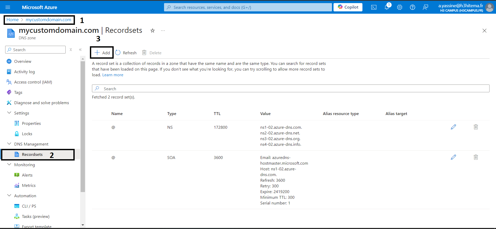
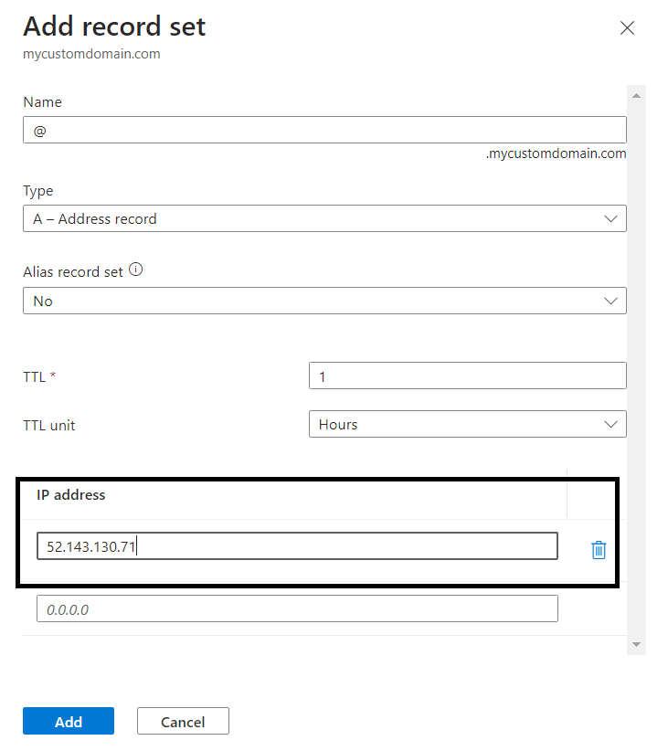
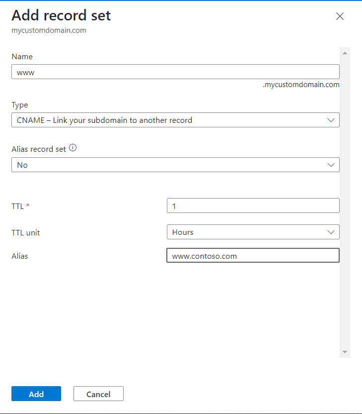
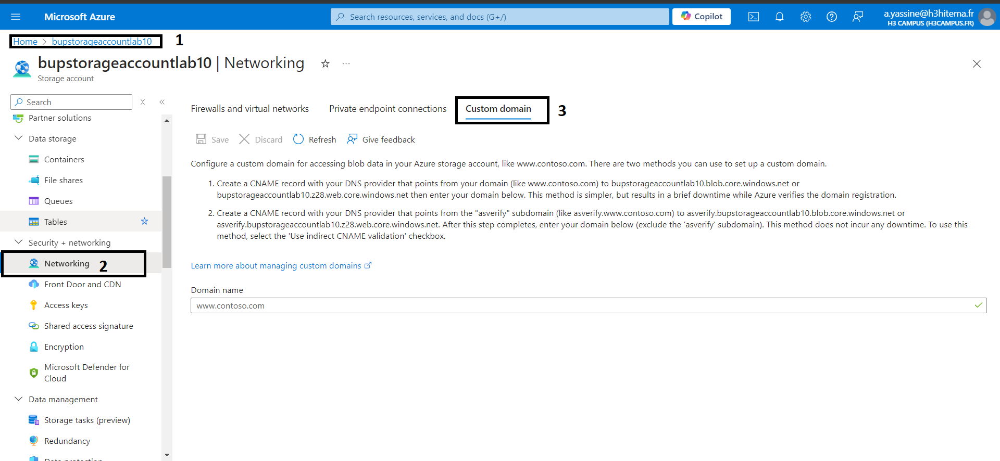
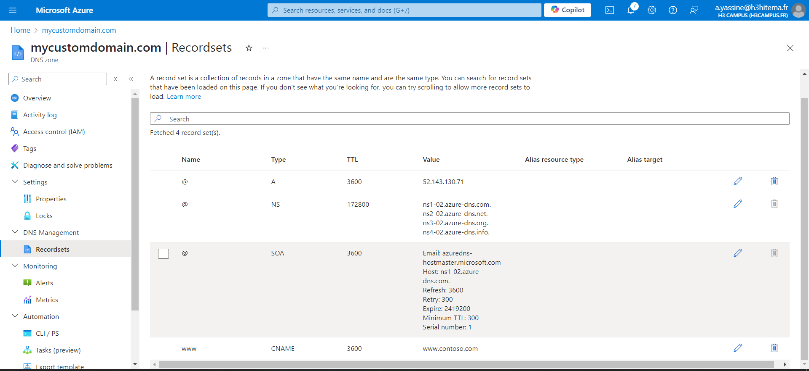

# 1) Create an Azure DNS Zone





#### Azure CLI

```
az network dns zone create --resource-group <nom_du_groupe> --name mycustomdomain.com
```

# 2) Manage DNS Records for a Custom Domain

## a) Add an A Record





#### 52.143.130.71 is one of the previously created VMs address with Nginix running on it


## b) Add CNAME Record



```
az network dns record-set a add-record --resource-group <nom_du_groupe> --zone-name mycustomdomain.com --record-set-name "@" --ipv4-address <adresse_ip_du_serveur>
```

# 3)  Configure Domain Verification and Mapping for the Storage Account

## a) Get the TXT Record for Domain Verification

#### If you’re configuring a custom domain for an Azure service (exemple: Storage Account), navigate to that service and go to the Custom domains section.

#### Copy the Domain verification TXT record provided 



```
az network dns record-set txt add-record --resource-group <nom_du_groupe> --zone-name mycustomdomain.com --record-set-name "@" --value "azure-site-verification=<verification_code>"
```

# 4) Implement DNS Aliases (CNAME) and Record Sets

## a) Create a CNAME Record


```
az network dns record-set cname set-record --resource-group <nom_du_groupe> --zone-name mycustomdomain.com --record-set-name "www" --cname mycustomdomain.com
```

## b) Create Additional Record Sets (A, MX, etc.):

#### You can add additional record sets following a similar process as before.

- For A records, use the IP address of the service.

- For MX records, you’ll need the mail exchange server details (if setting up email services).

- For NS records, the default NS records are automatically created, but you can add custom ones if needed.




## c) Testing DNS Configuration

#### Use nslookup or dig

- we can use tools like nslookup or dig to query your DNS records.

- Example for nslookup `nslookup www.example.com`