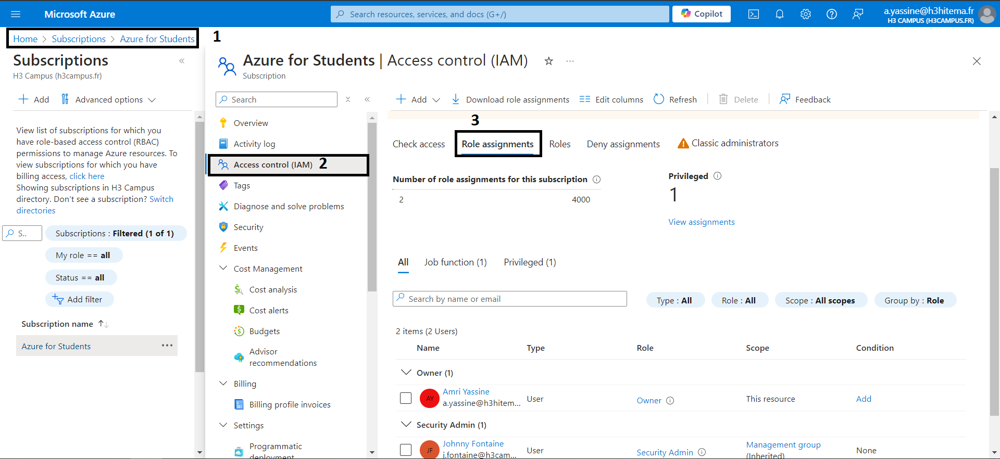
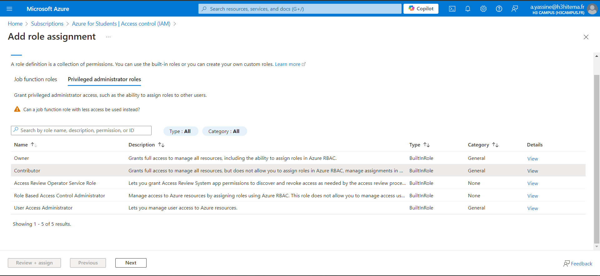
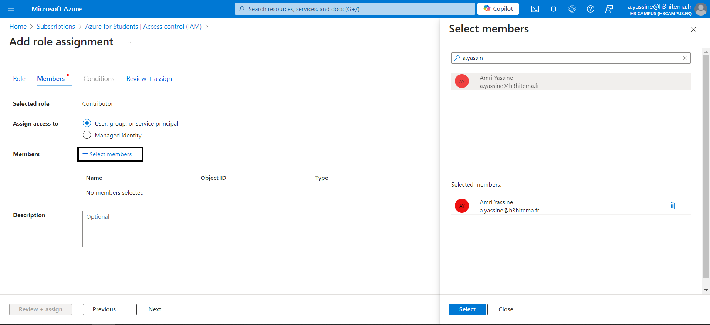
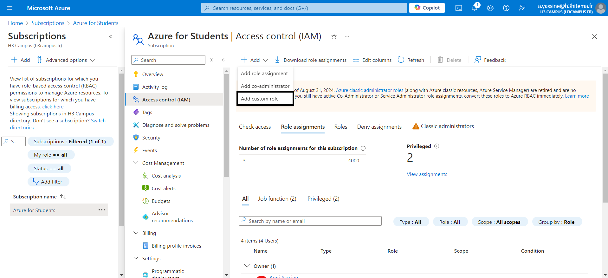
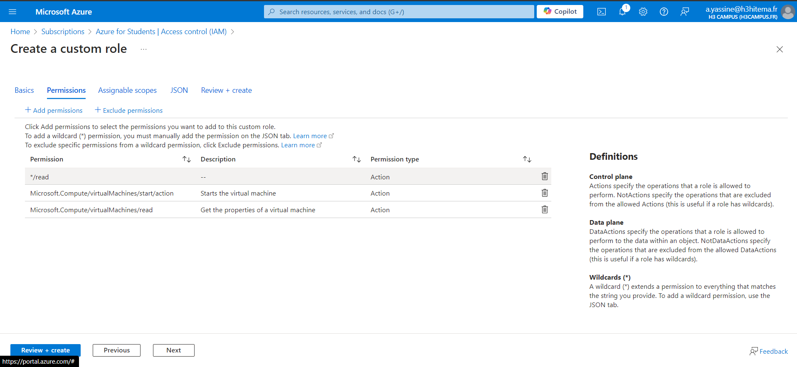
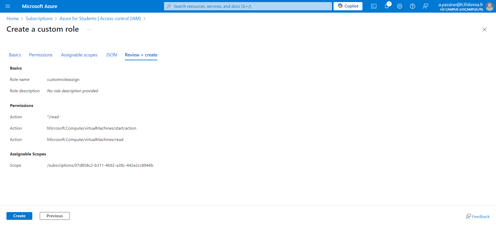
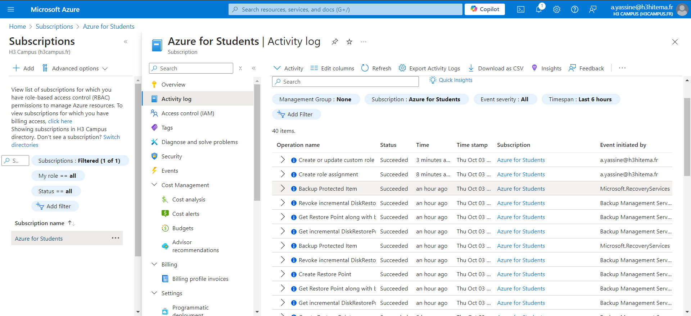

# 1) Assign Built-in Roles to Users and Groups







```
az role assignment create --assignee <user_email_or_object_id> --role "Contributor" --scope /subscriptions/<subscription_id>/resourceGroups <resource_group_name>
```

# 2) Create Custom Roles with Specific Permissions







# 3) Test Access Levels for Different Roles

#### Use Multiple User Accounts

- Log in to the Azure Portal using the account of the user you assigned a specific role to.

- Use separate browsers or incognito mode to log in as different users and test their access levels in parallel.

# 4) Audit Access Using Activity Logs

