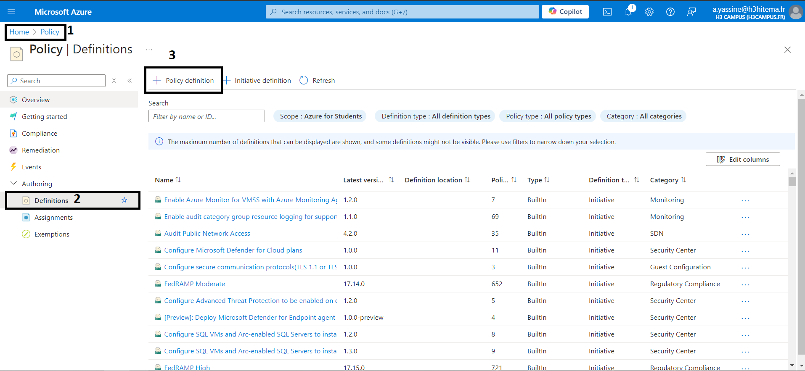
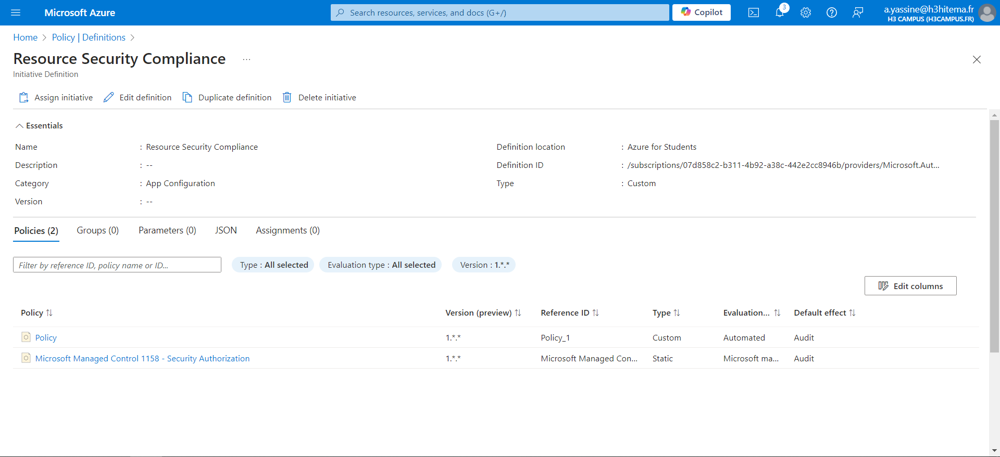

# 1) Create and Assign Azure Policies to Enforce Compliance




```
az policy assignment create --name "AllowedLocations" --policy "/providers/Microsoft.Authorization/policyDefinitions <policy_id>" --params '{"allowedLocations": {"value": ["East US", "West US"]}}' --scope "/subscriptions/<subscription_id>"
```

# 2) Use Initiatives to Group Multiple Policies




```
az policy set-definition create --name "SecureInitiative" --definitions '[{"policyDefinitionId": "/providers/Microsoft.Authorization/policyDefinitions/<policy1_id>"},{"policyDefinitionId": "/providers/Microsoft.Authorization/policyDefinitions/<policy2_id>"}]' --params '{"allowedLocations": {"value": ["East US", "West US"]}}'
```

# 3) Remediate Non-Compliant Resources


#### Remediate Non-Compliant Resources:

- If the policy supports Remediation, you will see a Remediate button.
- Click Remediate to automatically bring non-compliant resources into compliance.

```
az policy remediation create --name "RemediateNonCompliantResources" --policy-assignment "/subscriptions/<subscription_id>/providers/Microsoft.Authorization/policyAssignments/<policy_assignment_id>" --resource-discovery-mode ReEvaluateCompliance
```

# 4) Analyze Compliance Reports

#### Analyze compliance reports in the Policy panel to identify non-compliant resources and take appropriate action.
