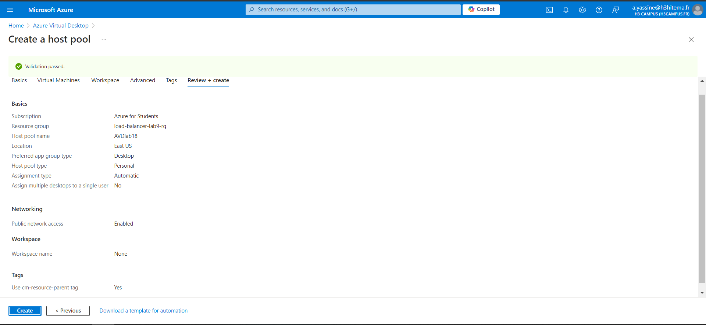
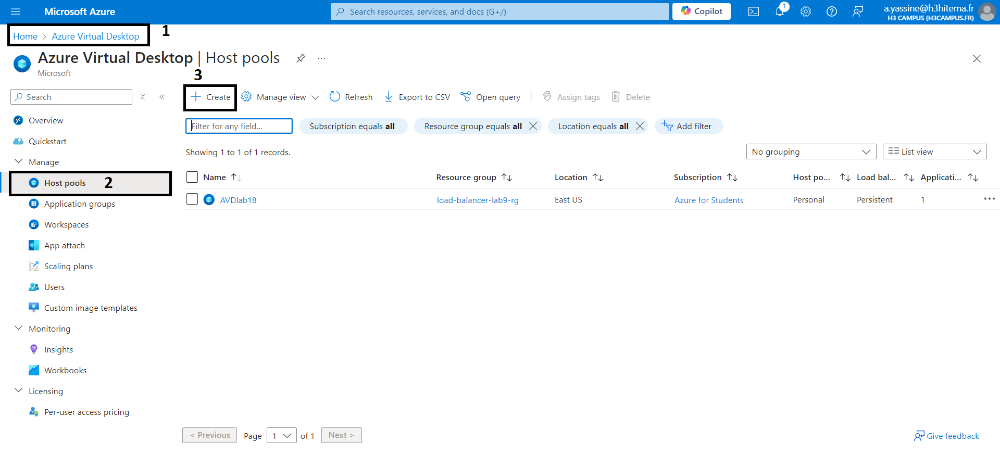
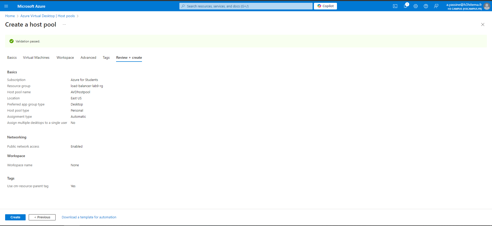
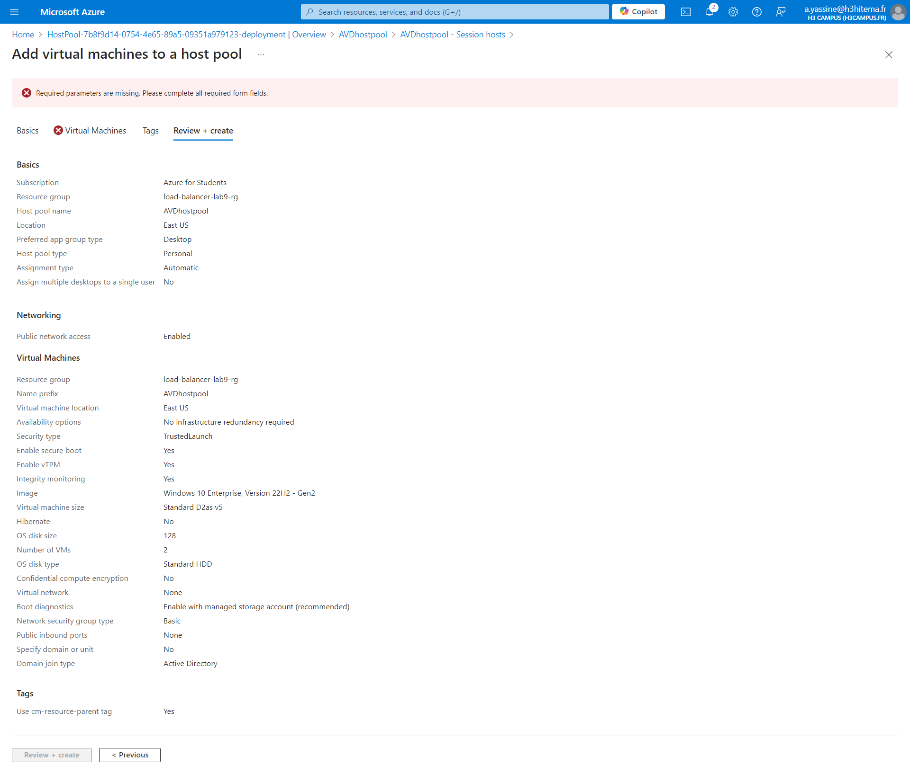
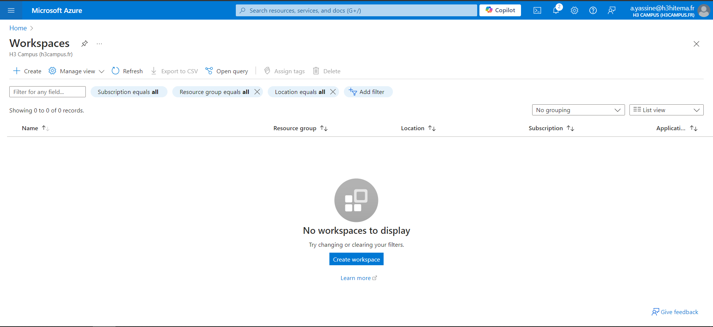
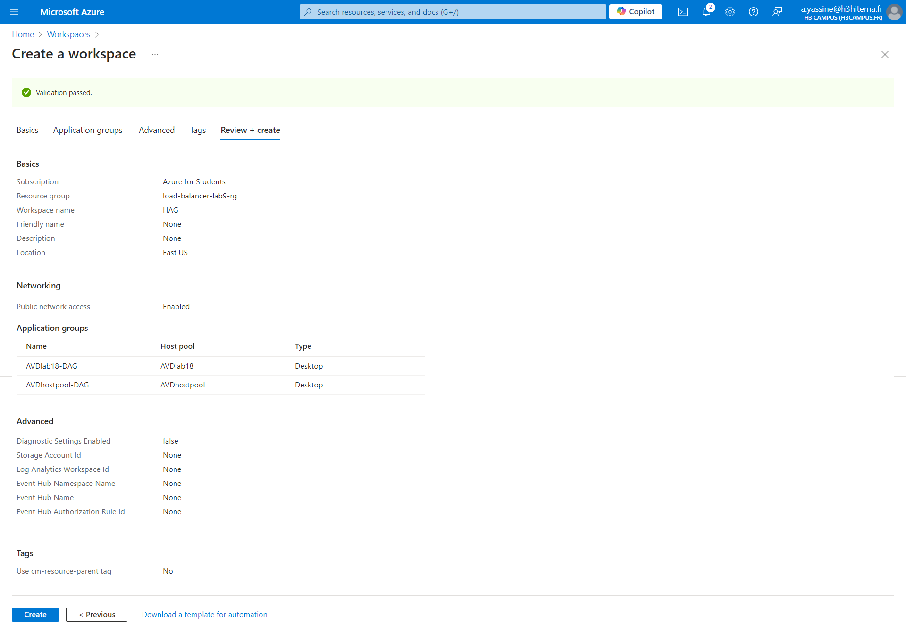
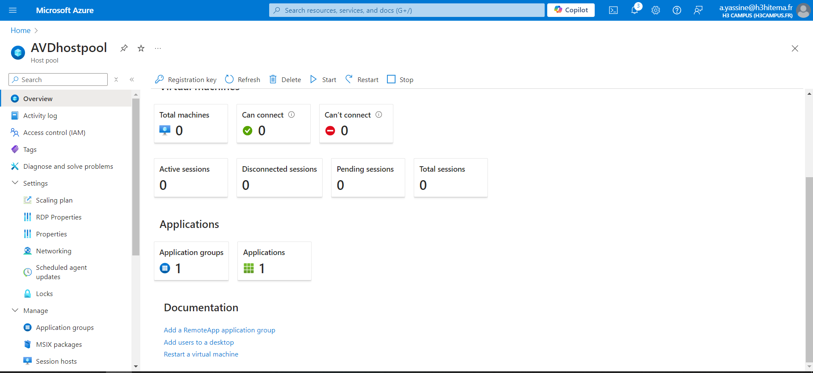

# 1) Set Up Azure Storage



```
az desktopvirtualization hostpool create --resource-group <nom_du_groupe> --name <nom_du_hostpool> --location <region> --friendly-name "Host Pool Lab18" --description "Host Pool for Azure Virtual Desktop Lab"

```

# 2) Configure Host Pools





# 3) Configure Session Hosts



```
az desktopvirtualization applicationgroup create --resource-group <nom_du_groupe> --host-pool-name <nom_du_hostpool> --name <nom_du_workspace> --location <region> --friendly-name "Workspace Lab18" --description "Workspace for Virtual Desktop Applications"
```

#### Set up Azure Active Directory Integratio (Optional)

- Configure integration with Azure Active Directory for secure user access.
- Set up permissions and roles for users to connect to the AVD environment.

# 4) Configure Workspaces





# 5) Publish Remote Desktop Applications



# 6) Connect to the Virtual Desktops as a User

#### Download and Install Remote Desktop Client

#### Log in with Azure AD credentials to access the assigned session host and published applications.