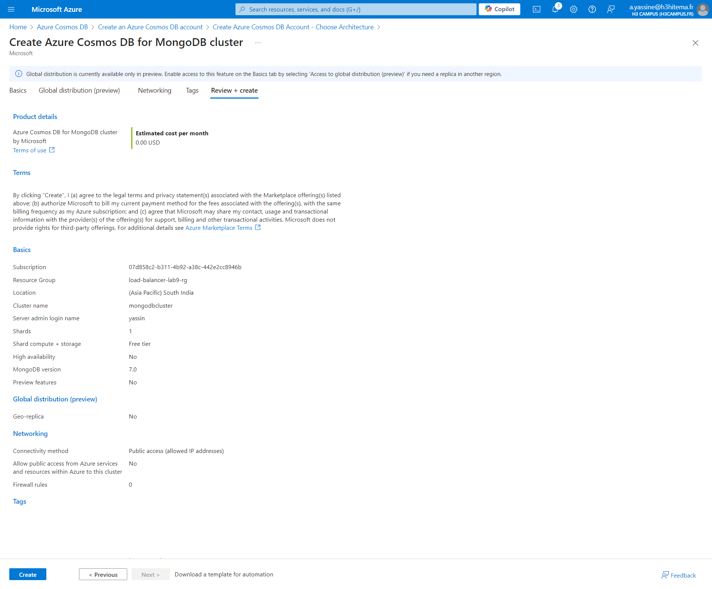
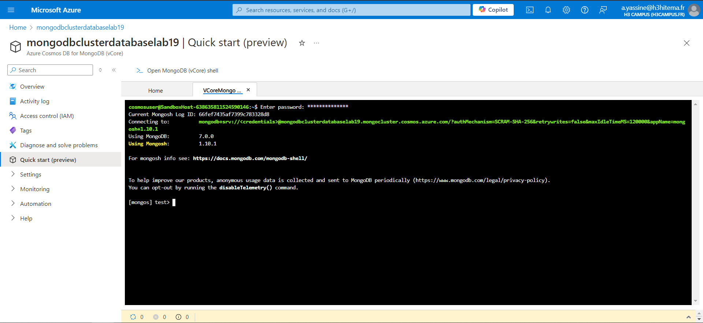
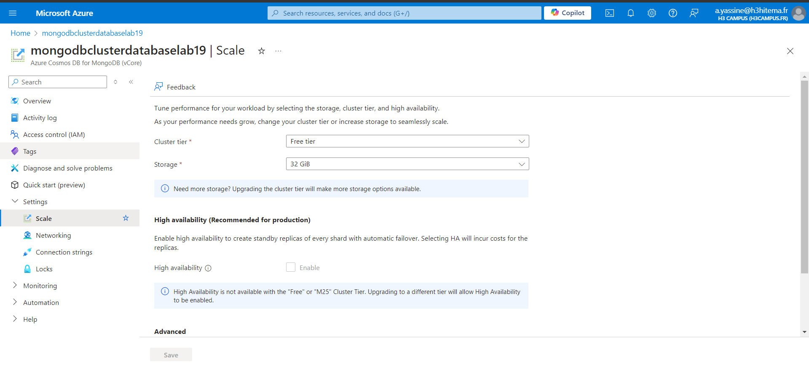

# 1) Create a Cosmos DB account with a chosen API (SQL, MongoDB, etc.)



```
az cosmosdb create --resource-group <nom_du_groupe> --name <nom_du_compte_cosmosdb> --kind MongoDB --locations regionName=<region> --default-consistency-level "Session"
```

# 2) Insert and Query Data using the Data Explorer

####  The Data Explorer might not be visible directly for MongoDB API accounts in the same way it is for other APIs (like SQL).

#### Use Mongo shell to create a database, a container, and insert JSON documents



```
az cosmosdb mongodb database create --account-name <nom_du_compte_cosmosdb> --resource-group <nom_du_groupe> --name <nom_base_de_donnees>
    
az cosmosdb mongodb collection create --account-name <nom_du_compte_cosmosdb> --resource-group <nom_du_groupe> --database-name <nom_base_de_donnees> --name <nom_du_container>
```

# 3) Configure Throughput and Partitioning

#### Azure Cosmos DB for MongoDB (vCore) allocates compute resources (virtual cores) and memory, unlike the provisioned throughput model (RU/s) used in other APIs.

#### Adjusting Resources: You can adjust the vCores and storage through the Settings tab. Look for options such as:

- vCores: Adjust the number of cores (CPU) for your MongoDB instance based on your workload.
- Storage: Adjust the storage amount allocated for your database.
- Scaling: In MongoDB vCore, scaling is done by adjusting the instance's vCores and storage capacity, rather than directly managing Request Units (RUs).



```
az cosmosdb mongodb collection throughput update --account-name <nom_du_compte_cosmosdb> --resource-group <nom_du_groupe> --database-name <nom_base_de_donnees> --name <nom_du_container> --throughput 400
```

# 4) Implement Global Distribution

