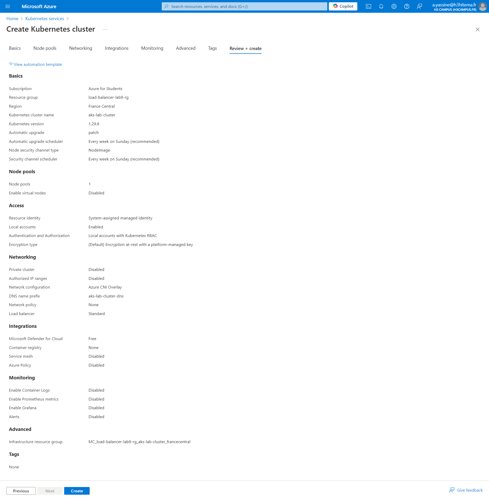
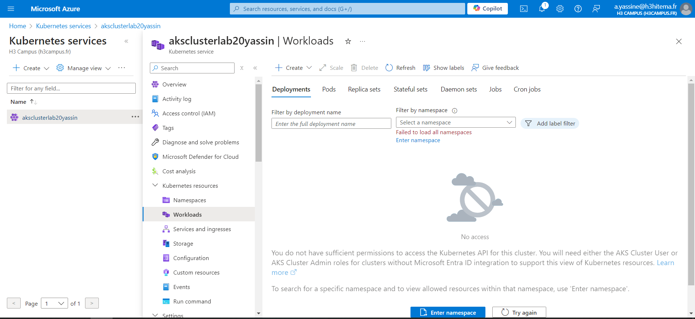

# 1) Set up an AKS cluster



```
az aks create --resource-group <nom_du_groupe> --name aksclusterlab20yassin --node-count 3 --enable-addons monitoring --generate-ssh-keys
```

# 2) Deploy a Containerized Application using Kubernetes Manifests

## a) Install the Azure CLI and Kubernetes Tools

`az aks install-cli`

## b) Connect your CLI to your AKS cluster:

`az aks get-credentials --resource-group aks-lab-rg --name aks-lab-cluster
`

## c) Create Kubernetes Manifests

#### Create a deployment YAML file, for example, nginx-deployment.yaml

#### Apply the manifest to your AKS cluster

`kubectl apply -f nginx-deployment.yaml`

## d)  Expose the Application

#### To expose the application using a LoadBalancer, create a service YAML file, nginx-service.yaml

#### Apply the service manifest:

`kubectl apply -f nginx-service.yaml`

#### To get the external IP of the load balancer

`kubectl get service nginx-service`

#### Access the app using the external IP address in your browser.

# 3) Scale Applications and Manage Pods

#### In the Kubernetes resources interface, adjust the number of replicas from the deployment by modifying the parameters.



```
kubectl scale --replicas=4 deployment/nginx-deployment
```

# 4) Implement Network Policies for Pod Communication

## a) Create a network policy YAML file network-policy.yaml

#### This policy allows only traffic from pods with the frontend label to communicate with the nginx pods on port 80, and restricts outbound traffic to backend pods on port 8080.

#### Apply the policy to the cluster

```
kubectl apply -f network-policy.yaml

```

## b) Verify the Network Policy

#### Try to access the nginx pods from other pods that do not match the frontend label, and confirm that the connection is blocked.