## 1) Create an Azure App Service plan

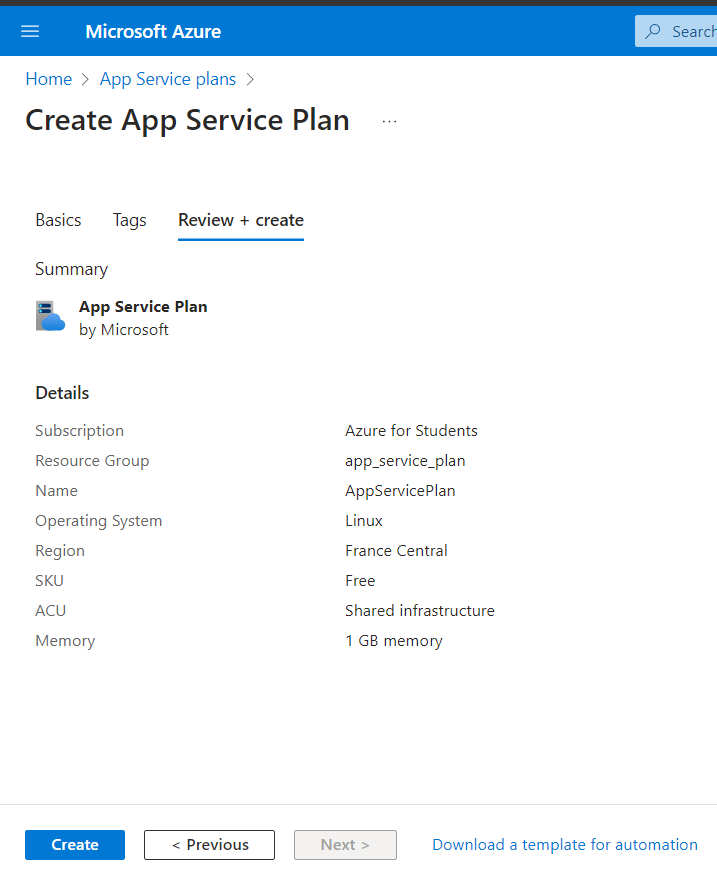

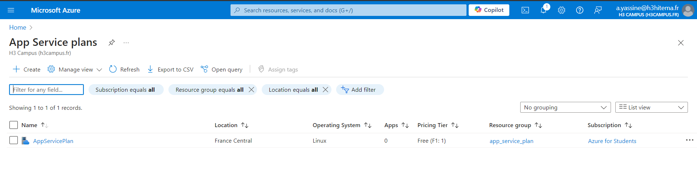

## 2) Deploy a web application using Azure App Service

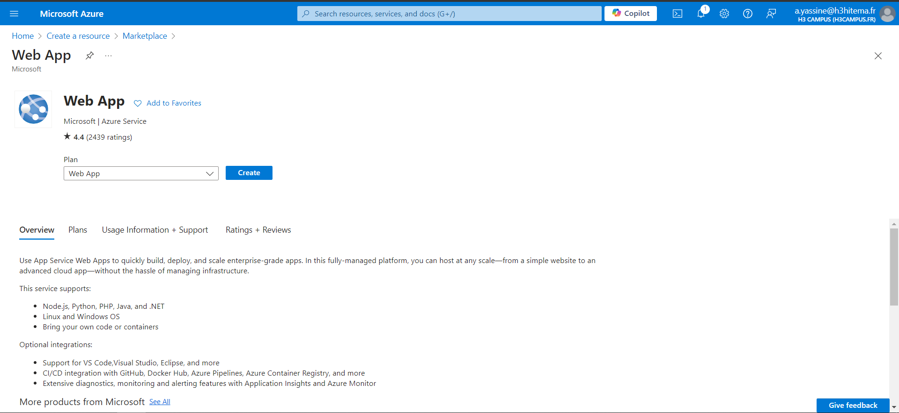

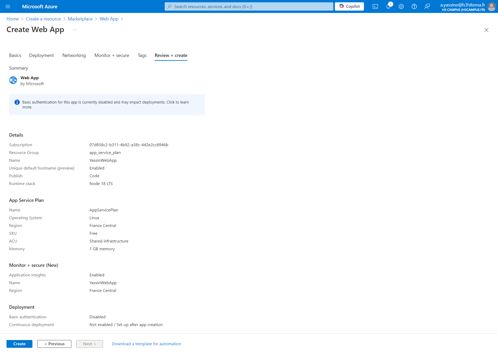

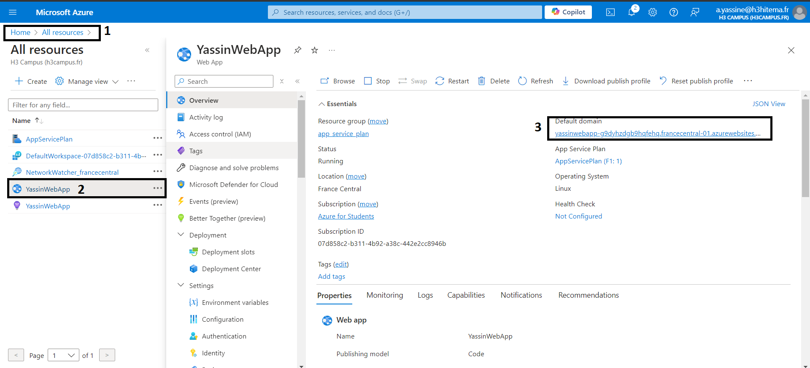

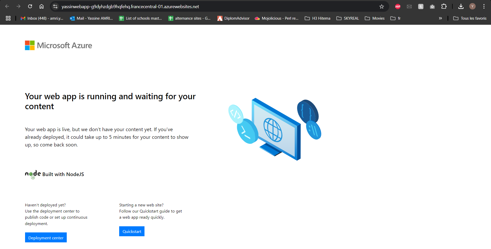

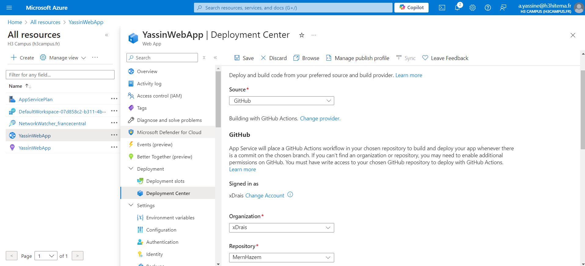

a) We can use multiple demployment sources such as the Azure portal, GitHub, or via FTP/SFTP.

## 3) Configure custom domains and SSL certificates

#### a) custom domains

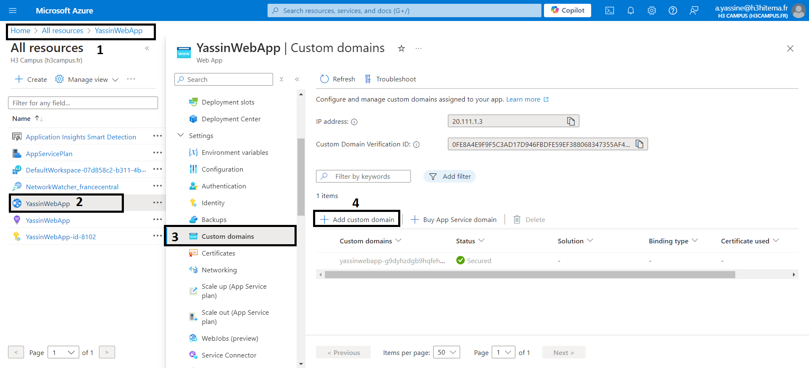

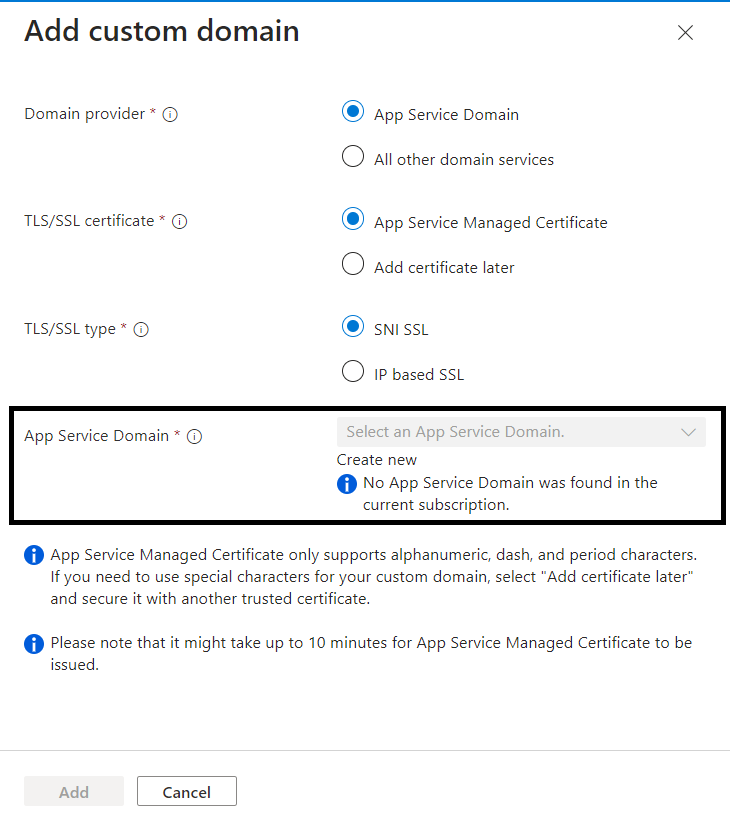

#### Domain provider is either the azure one or an external domain service
#### Since we don't have an app service domain we need to create a new one 

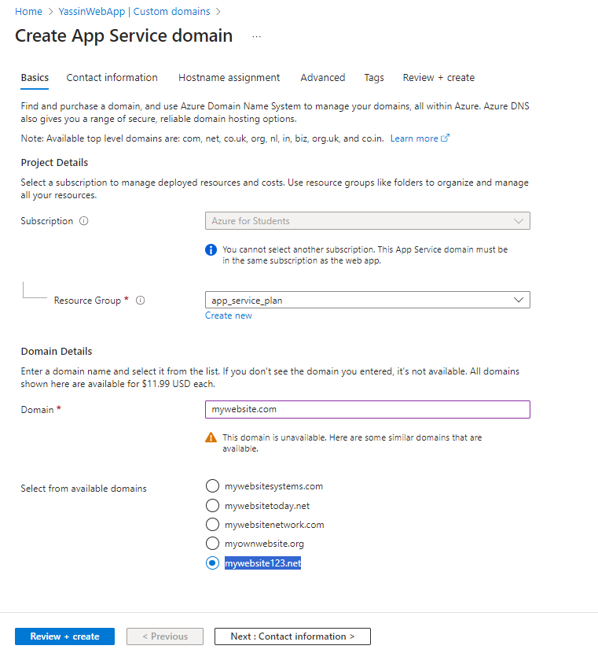

	mywebsite123.net this will be the domain name since mywebsite.com is not available 

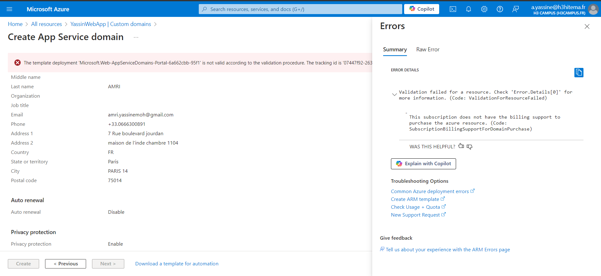

no Bailing support to buy a domain with H3 account 

without a custom domain we can't add an SSL cerification

## 4) Implement deployment slots for staging and production

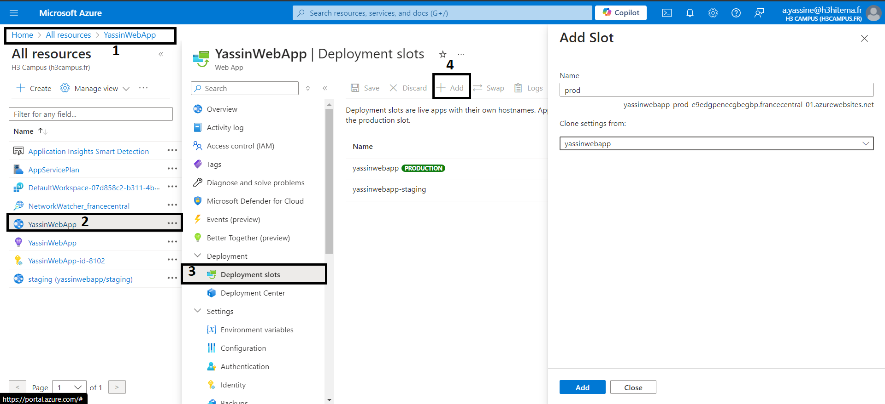
