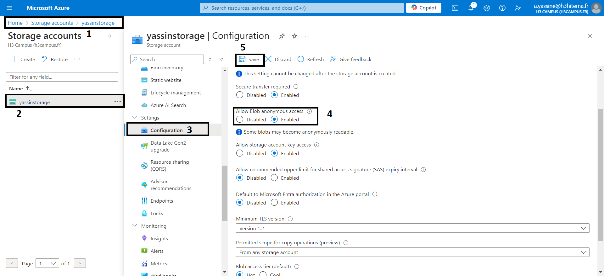
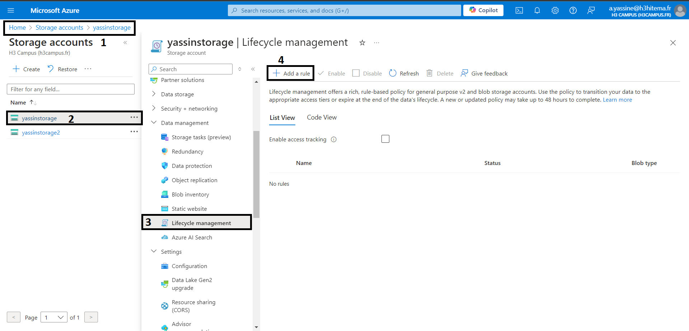

# 1) Create a Storage Account with different replication options.

### Replication/Redundancy types
##### LRS (Locally-redundant storage): 3 copies within a single region.
##### ZRS (Zone-redundant storage): 3 copies across multiple availability zones in the same region.
##### GRS (Geo-redundant storage): Replicated to another region (for disaster recovery).
##### RA-GRS (Read-access Geo-redundant storage): Provides read access to the replicated data in the secondary region.

# 2) Upload and manage blobs using Azure Portal and Azure CLI
## a) Create container to upload our blob files in it 

##### !!! If we cant change the Anonymous access level for the container we should change the storage accounts config like in the next screenshot

## b) upload our blob files in the container

# 3) With Azure CLI

## a) Create storage account with CLI

az storage account create --name yassinstorage2 --resource-group app_service_plan --location francecentral --sku Standard_LRS

## b) Create container in storage account using the CLI

#### Solution 1 : Use Account Key

##### we need to retrive the storage account credentials first 
az storage account keys list --account-name yassinstorage2 --resource-group app_service_plan

##### now we can use the key to create the container in the storage account

az storage container create -n yassincontainer2 --account-name yassinstorage2 --account-key <Key-value> --public-access blob

##### to verify the container creation we use this command :

az storage container list --account-name yassinstorage2 --account-key <Keu_value> --output table

#### Solution 2 : Use a Connection String

##### retrive the connection string

az storage account show-connection-string --name yassinstorage2 --resource-group app_service_plan

##### Use the connection string to create the container:

az storage container create -n yassincontainer3 --connection-string <ConnectionStrinKey>  --public-access blob

az storage container create -n yassincontainer2 --account-name yassinstorage2 --public-access blob

#### Solution 3: Use Azure AD Authorization

az storage container create -n yassincontainer4 --account-name yassinstorage2 --public-access blob --auth-mode login

## C) Upload blob file to container

az storage blob upload --account-name yassinstorage2 --container-name yassincontainer2 --name Blobcli --file "C:/Users/Facto/Desktop/Archi Cloud & FINOPS/tp 4/blobexample.blob" --account-key <accountkey>

# 4) Set up Shared Access Signatures (SAS) for secure access.

#### Using the cli:

az storage container generate-sas --account-name yassinstorage --name yassincontainer --permissions rwdl --expiry 2024-11-02T08:29:28Z --https-only

# 5)  Implement lifecycle management policies

### Using Auzre cli

we need to create a file json ex : policy.json

and use this command 

az storage account management-policy create --account-name yassinstorage --policy @policy.json --resource-group app_service_plan
