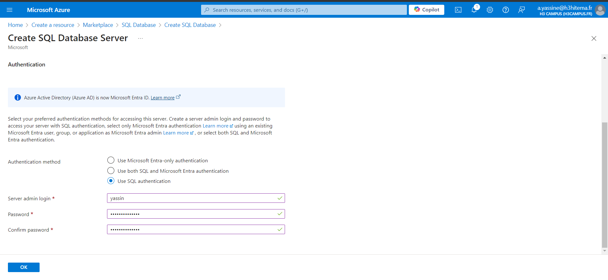
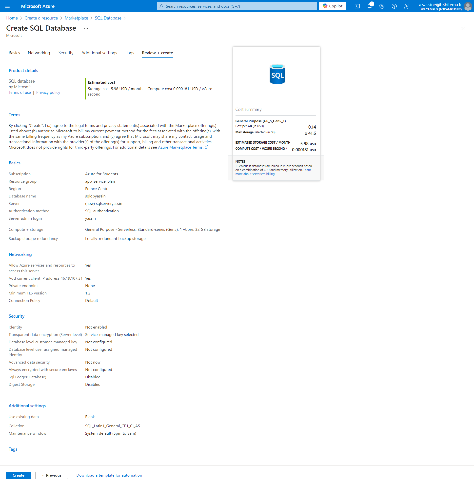
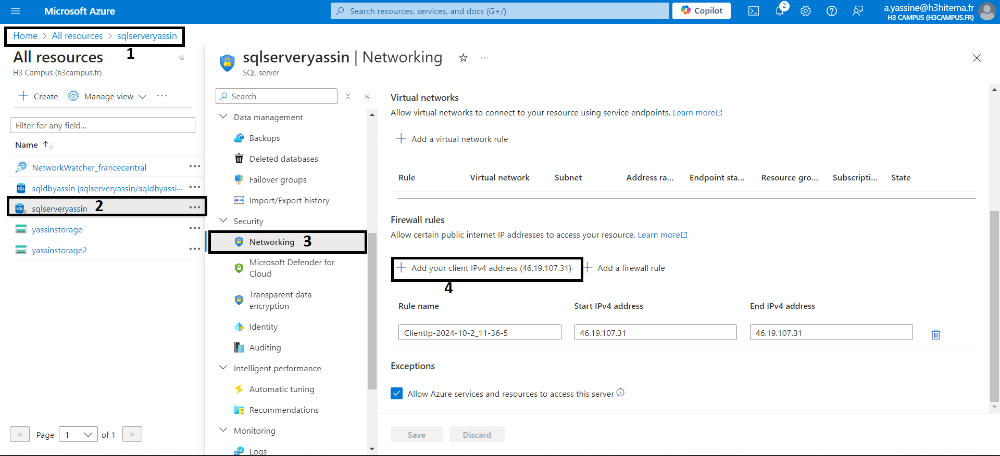
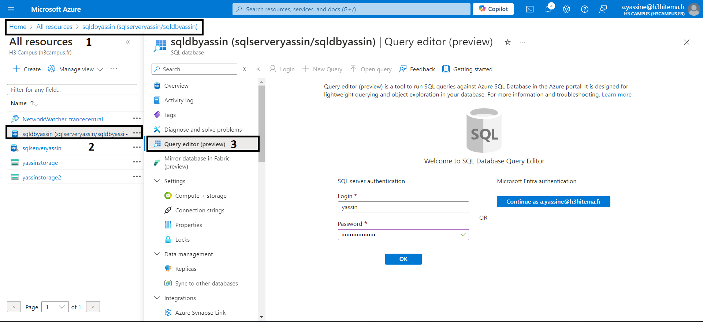
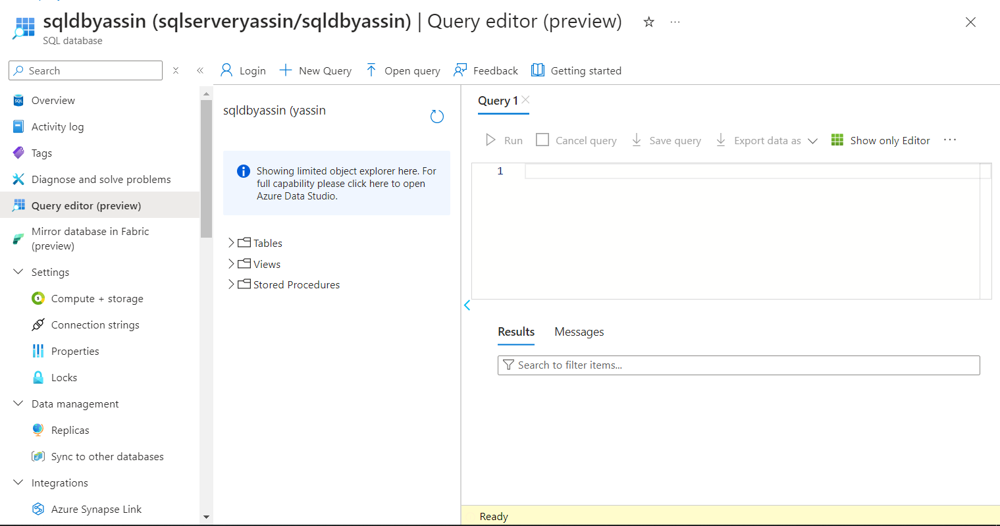
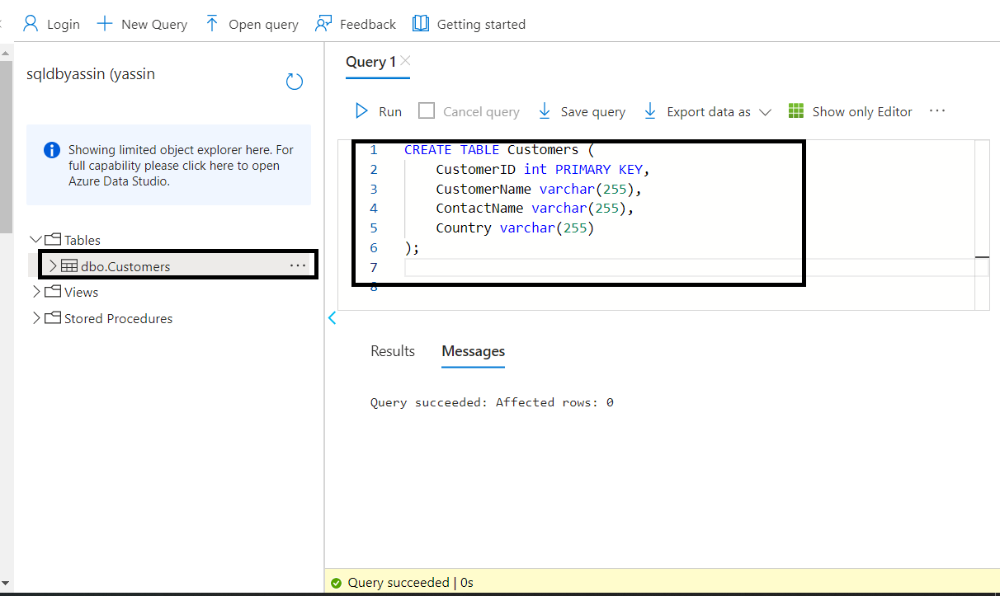
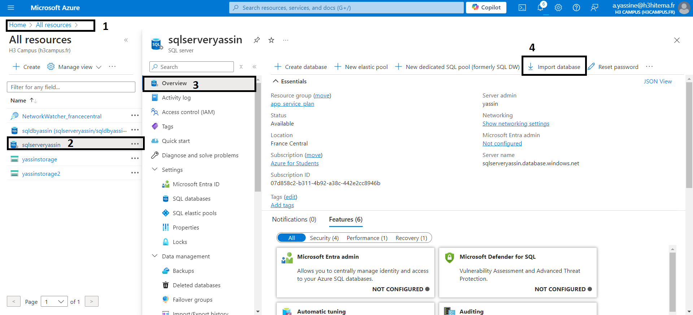
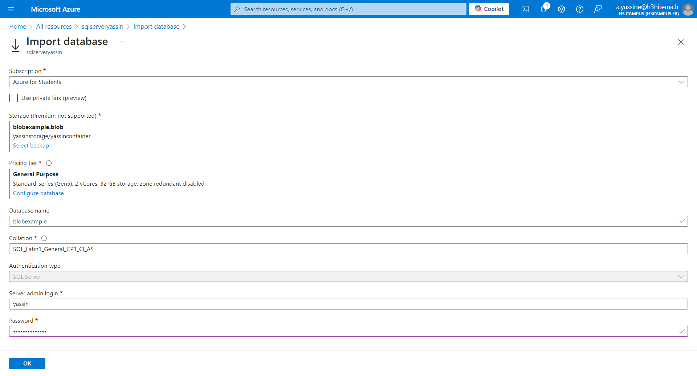
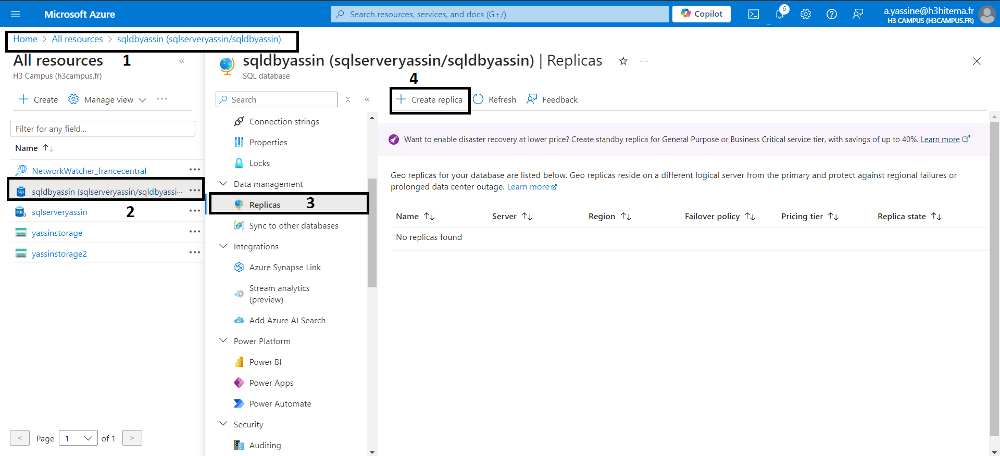
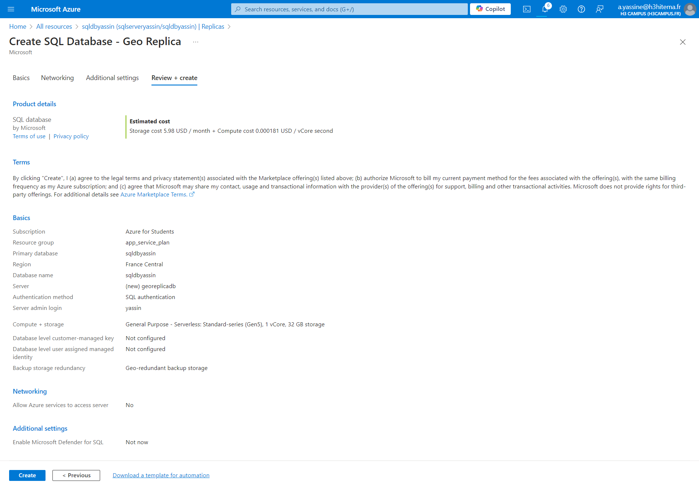

# 1) Deploy an Azure SQL Database instance

## we need to create a server first

## Then we create our Sql Database

# 2) Configure Firewall Settings to Allow Client Access

To add the current client ip Adress

To add more addresses we can use the Add firewall rule to define the rule and range of ip adress that can access our Sql DB

# 3) Import data into the database

## We can use SSMS to connect to our SqlDb
## or we can use Query Editor (Preview) in azure

## After we login with the admin creds

## We pass and sql command to create the customer table

### If we want to import data to our Sqldb we can use the Bulk Insert feature or tools like Azure Data Studio or SSMS to load CSV or SQL files.

### If we want to import a database 

# 4) Implement Geo-replication for high availability

#### we need to create a new server like the one called georeplicadb

