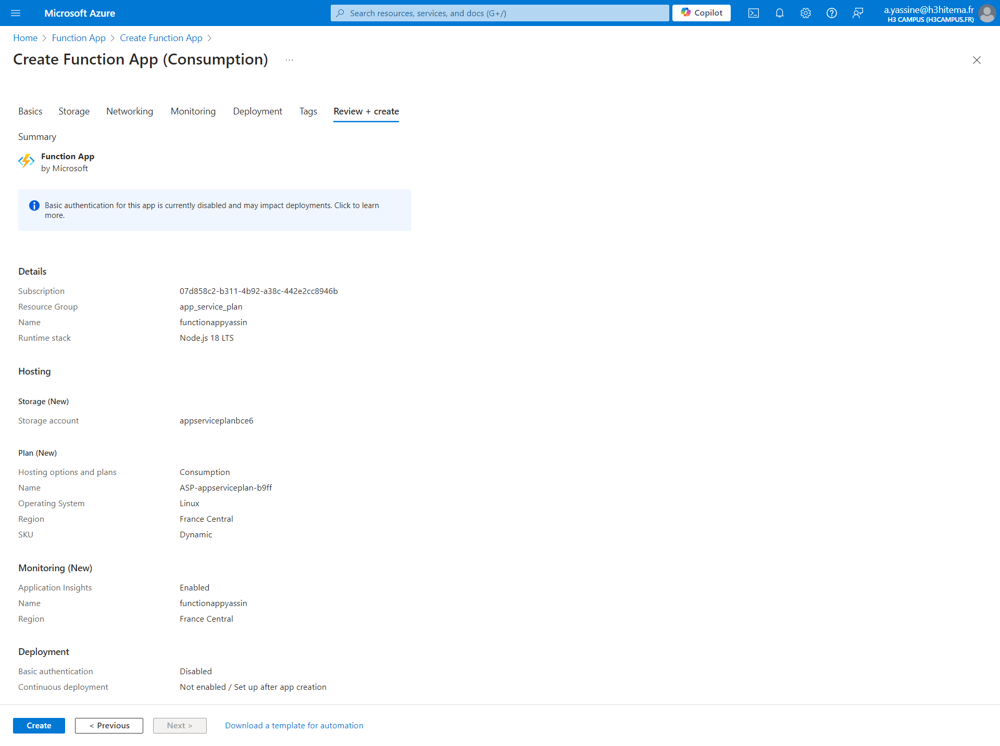
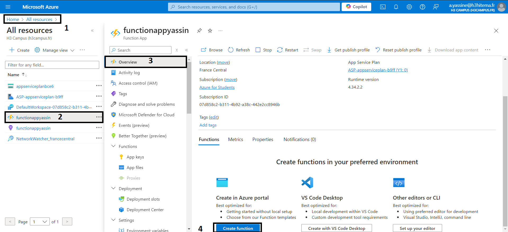
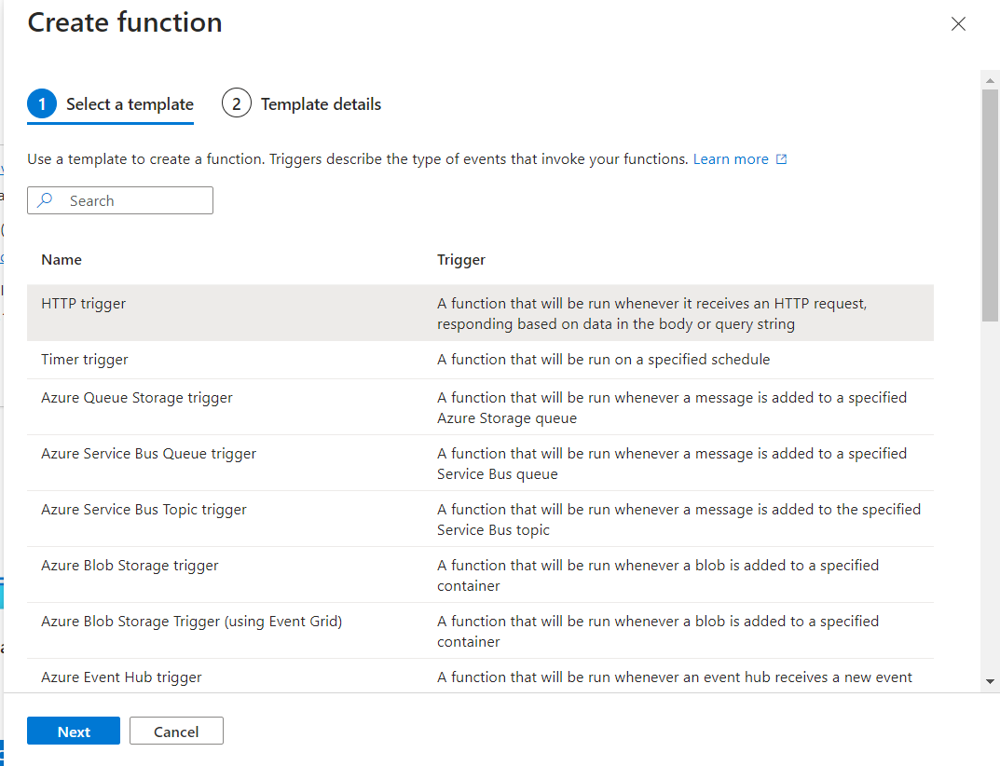
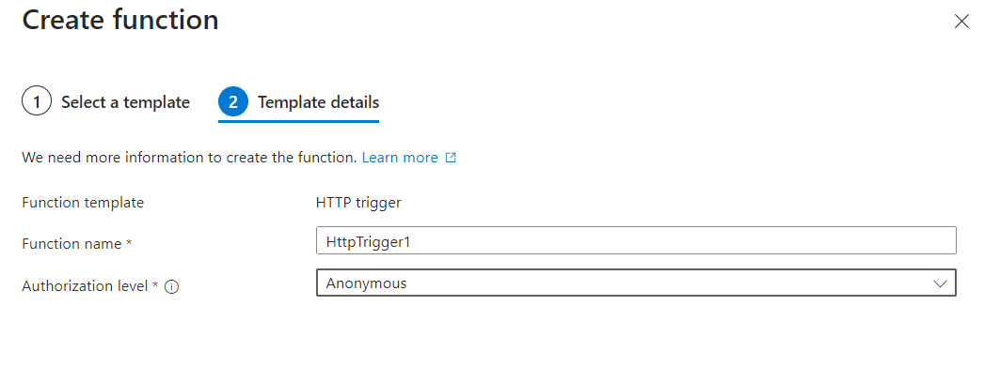
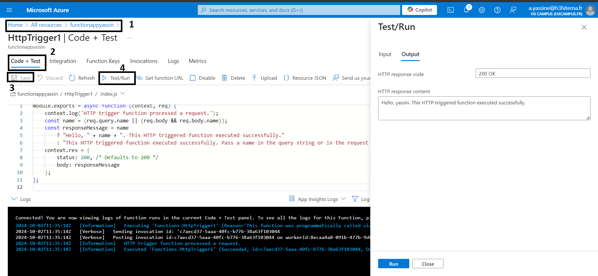
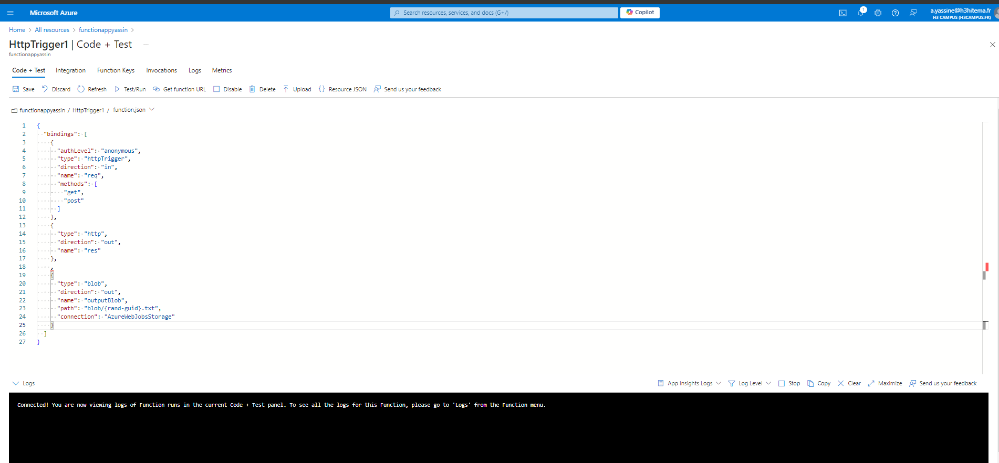
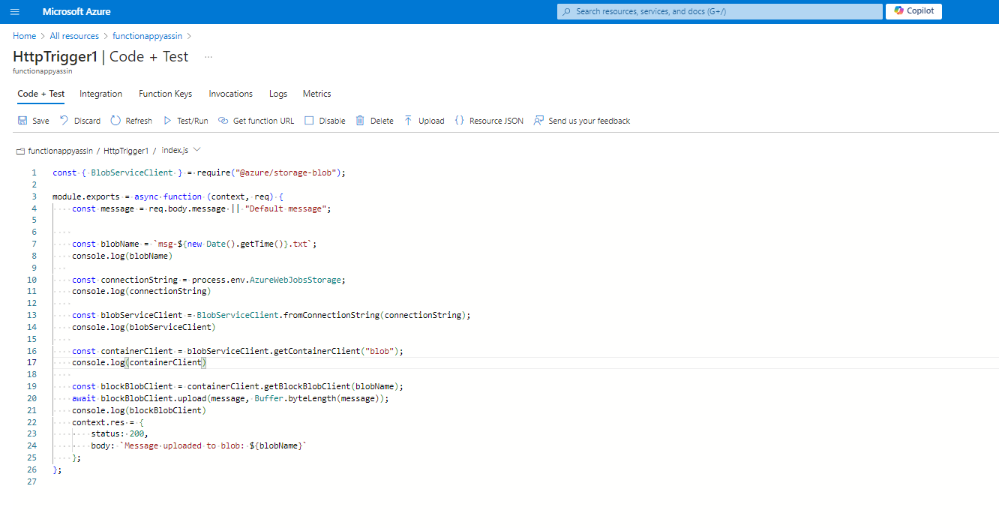
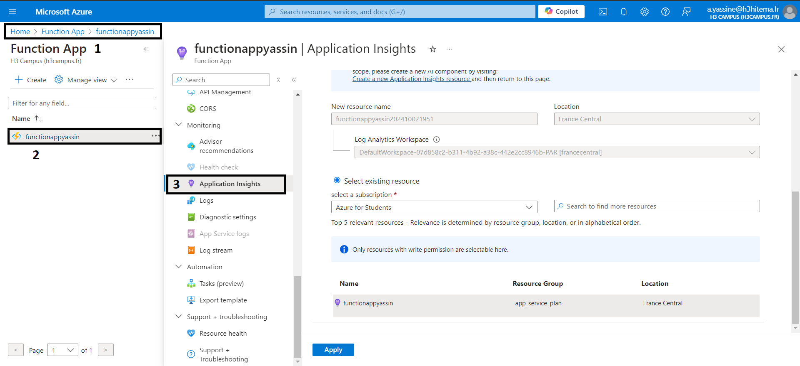
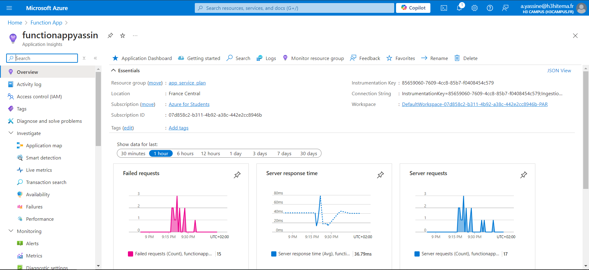

# 1) Create an Azure Function App

# 2) Develop a Serverless Function Triggered by an HTTP Request

####  Select the template for the function as HTTP

#### Choose auth for the function anonymous is for simplicity

- Function uses a function key
- Admin uses your master key

The function and master keys are found in the 'keys' management panel on the portal, when your function is selected. For user-based authentication, go to Function App Settings.

#### After the function creation we can modify the code and do some tests on its functionality by chaning the code and doing save and Test/run

# 3) Integrate the function with Azure Storage or Azure Queue

# 4)  Monitor function performance and logs.

