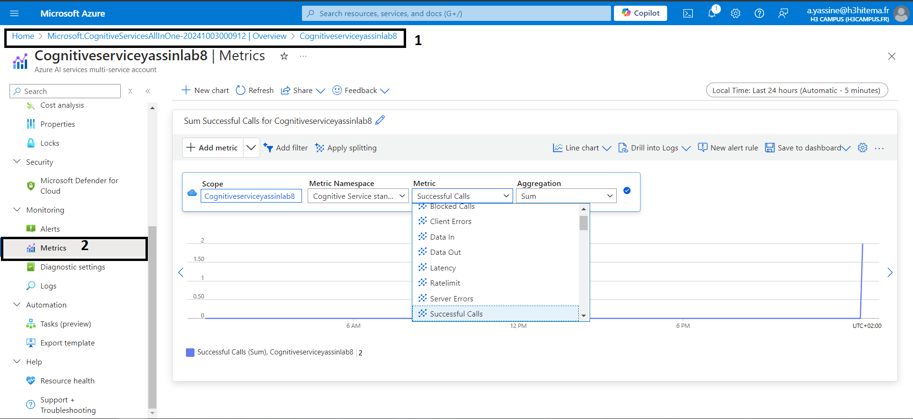

# 1) Create a Cognitive Services resource (new name is Azure AI services)


### we need to get the endpoint and one of the keys to use the service these will be used in your application to authenticate the API calls

Commande Azure CLI équivalente :
```
az cognitiveservices account create \
  --name CognitiveLab8 \
  --resource-group <nom_du_groupe> \
  --kind TextAnalytics \
  --sku S0 \
  --location <region> \
  --yes
```

# 2) Develop an application that uses the Text Analytics API

### Set Up Your Development Environment

```
mkdir azure-cognitive-lab

cd azure-cognitive-lab

npm init -y
```

### Install the Azure SDK for Cognitive Service

`npm install @azure/ai-text-analytics dotenv`

### setup or .env for the our key and endpoint we need to install the dotenv package, which allows Node.js to load environment variables from a .env file into process.env

`npm install dotenv`

# 3) Analyze sentiment and key phrases from sample text

### now after writing our node.js index script we can run it and view the result


run
`node index.js`
```
PS C:\Users\Facto\Desktop\Archi Cloud & FINOPS\tp 8\azure-cognitive-lab> node index.js
>> 
Document Sentiment: positive
Confidence Scores: { positive: 0.99, neutral: 0, negative: 0 }
Document Sentiment: negative
Confidence Scores: { positive: 0, neutral: 0, negative: 1 }   
Key Phrases: programming, JavaScript
Key Phrases: weather
```

# 4) Monitor API usage and manage keys

