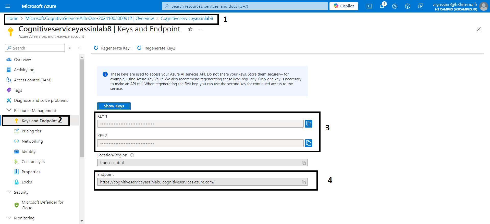

# 1) Create a Cognitive Services resource

Commande Azure CLI équivalente :
az cognitiveservices account create \
  --name CognitiveLab8 \
  --resource-group <nom_du_groupe> \
  --kind TextAnalytics \
  --sku S0 \
  --location <region> \
  --yes

# 2) Develop an application that uses the Text Analytics API

#### Install the Azure Cognitive Services Text Analytics
pip install azure-ai-textanalytics

#### 
from azure.ai.textanalytics import TextAnalyticsClient
from azure.core.credentials import AzureKeyCredential

# Set your Azure Cognitive Services Key and Endpoint
api_key = "YOUR_API_KEY"
endpoint = "YOUR_ENDPOINT"

# Authenticate the client
def authenticate_client():
    ta_credential = AzureKeyCredential(api_key)
    text_analytics_client = TextAnalyticsClient(endpoint=endpoint, credential=ta_credential)
    return text_analytics_client

# 2) Analyze Sentiment

# 3) Analyser les résultats de l'API

