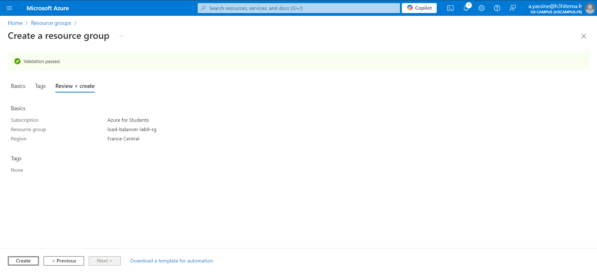

# 1) Deploy Azure Load Balancer

## Créez un Load Balancer dans le portail Azure :

- Name : LoadBalancerLab9
- Region : Sélectionner une région appropriée
- Frontend IP Configuration : Associer une IP publique

#### Commande équivalente (Azure CLI)

az network lb create \
  --resource-group <nom_du_groupe> \
  --name LoadBalancerLab9 \
  --frontend-ip-name FrontendConfig \
  --public-ip-address <nom_ip_publique>

# 2) Configure health probes and load balancing rules

az network lb probe create \
  --resource-group app_service_plan \
  --lb-name LoadBalancerLab9 \
  --name HealthProbeLab9 \
  --protocol Http \
  --port 80 \
  --path /

  az network lb rule create \
  --resource-group app_service_plan \
  --lb-name LoadBalancerLab9 \
  --name LbRuleLab9 \
  --frontend-ip-name FrontendConfig \
  --backend-pool-name BackendPoolLab9 \
  --probe-name HealthProbeLab9 \
  --protocol Tcp \
  --frontend-port 80 \
  --backend-port 80