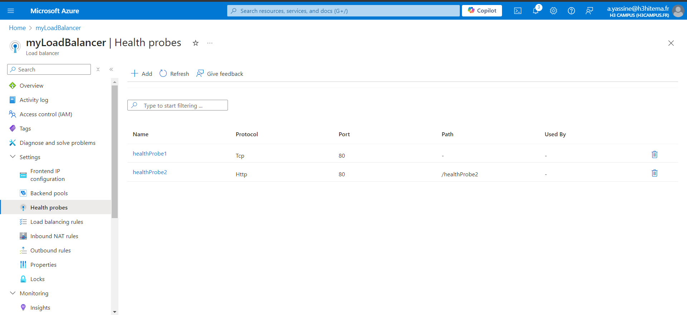

# 1) Deploy Azure Load Balancer

## a) Create a new resources groupe


## b) Create VM we need at least 2 to use the load balancing for traffic disstribution and make sure they are under the same Vnet so we won't need to configure a network peering or create a new Vnet before creating the VMs because azure doesnt allow you to change it after the deployment of the VMs


### In case our VM is created without a public ip we can assign one to it 


### Connect to the VMs using ssh to Install a Web Server (NGINX for linux and IIS (Internet Information Services) for windows)


```
sudo apt update
sudo apt install nginx -y
```

## c) Deploy Azure Load Balancer

#### we need to assign a Frontend IP configuration (FrontIpConfig) and Assign a Public IP address or create a new one (lbPublicIP)


## d) Configure Backend Pool


#### We need to select the Virtual Network that has both VMs in it and for the ip configuration we add both VMs IPs


#### don't forget to select the added IPs and save


# 2) Configure health probes and load balancing rules

## a) Configure health probes




## b) load balancing rules


# 3) Set up Azure Traffic Manager for DNS-based traffic routing

## a) Create an Azure Traffic Manager Profile 


## b) Add Endpoints to Traffic Manager


#### "No DNS name is configured" means that the public IP selected (lbPublicIP) does not have a DNS name associated with it yet. Azure Traffic Manager can still use the IP address for traffic routing, so this message does not affect the functionality of the lab

#### In case we cant add the endpoint we need to configure the DNS for the public Ip address


# 4) Test Failover Scenarios

#### We need to add an inbound rule to allow traffic from port 80 for http


#### Test Traffic Manager:
You can change the routing method in Traffic Manager to test different scenarios (e.g., Performance, Priority, Failover).

Test DNS-based routing by using the Traffic Manager DNS name (which will distribute traffic based on routing rules).