## 1) Create a Virtual Network (VNet) with multiple subnets

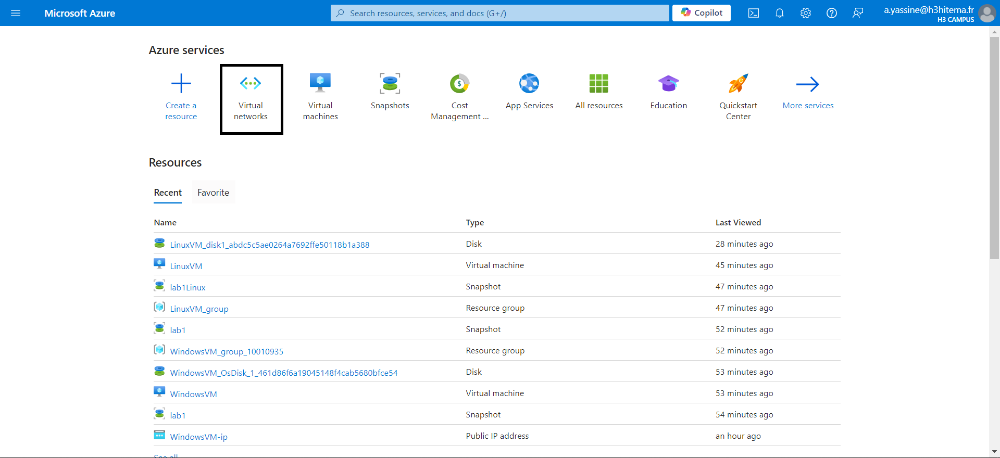

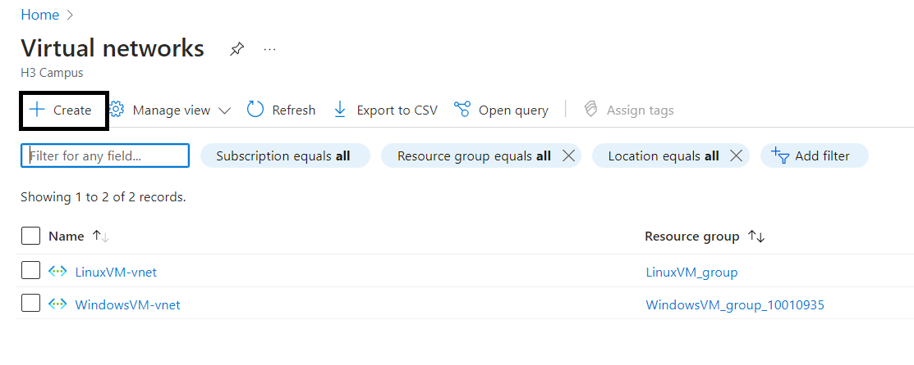

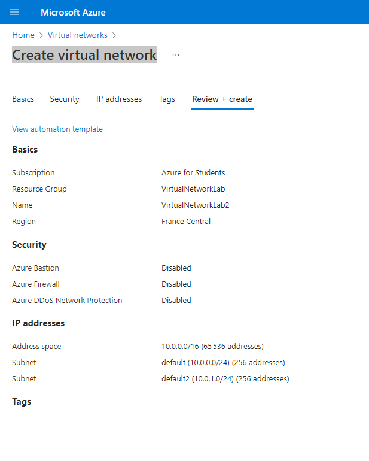

## 2) Set up Network Security Groups (NSGs) to control inbound and outbound traffic

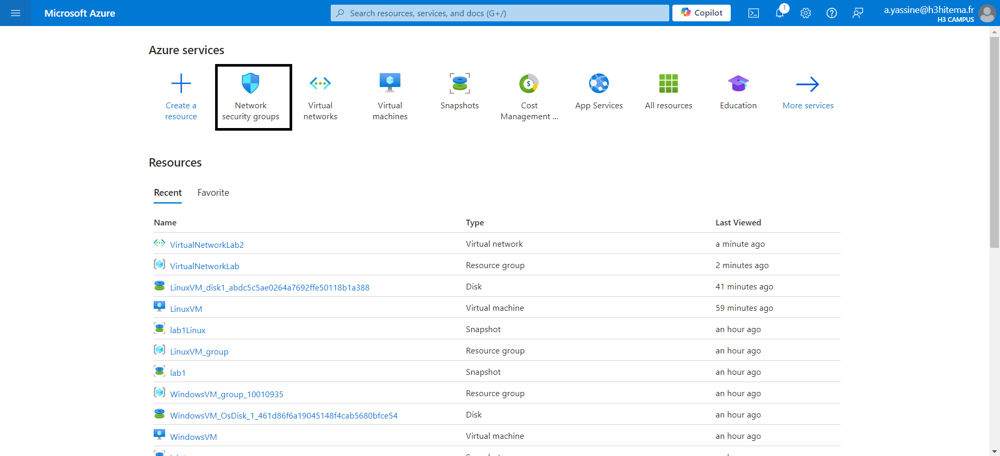

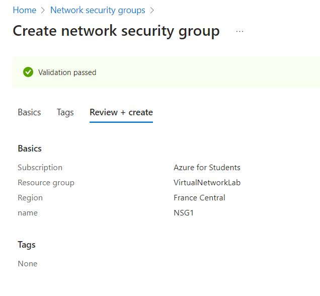

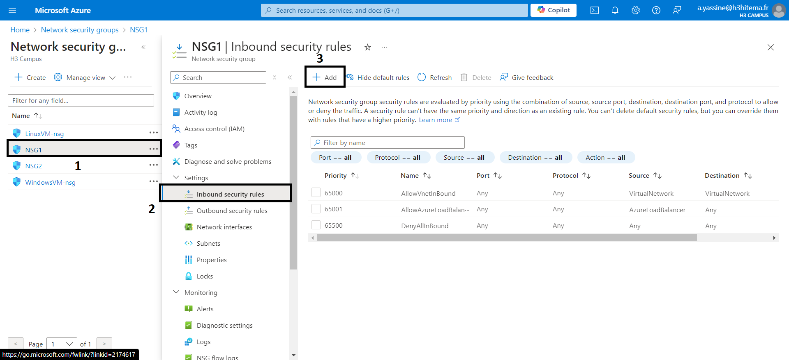

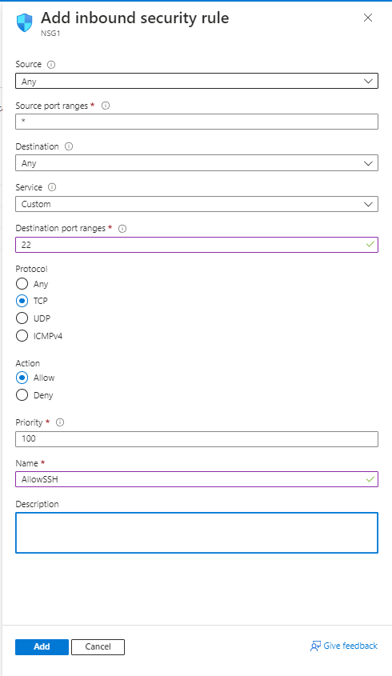

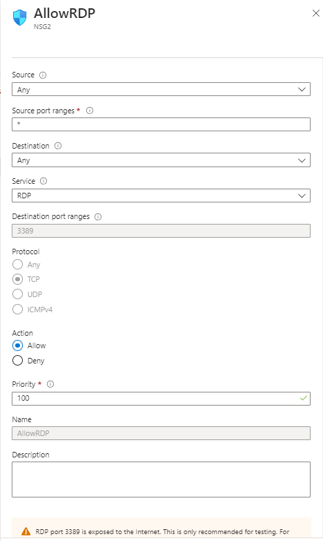

## 3) Deploy VMs into specific subnets.

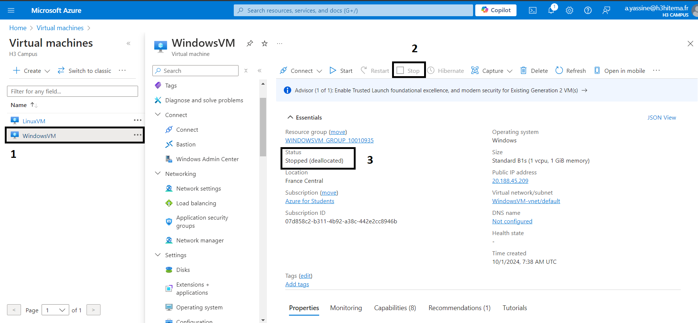

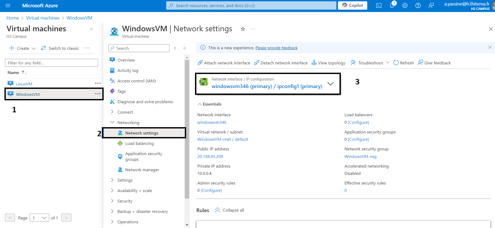

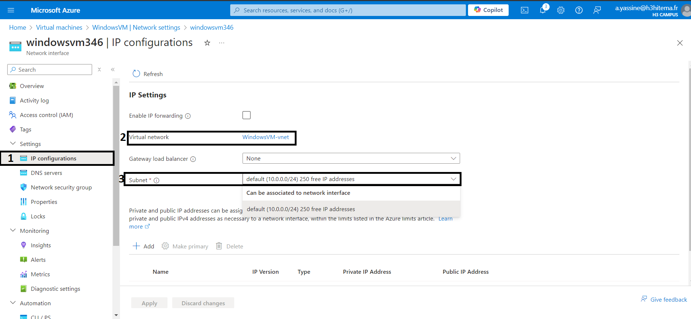

2) we can change the Virtual network group if we want to use 2 VMs under the same group and with defined subnets so we dont need the Vnet peering

3) if we do the change of network group like in the 2nd step we will find 2 subnets to select if not we will find only 1 subnet since we have the default vnet

##  4) Configure VNet peering between two VNets

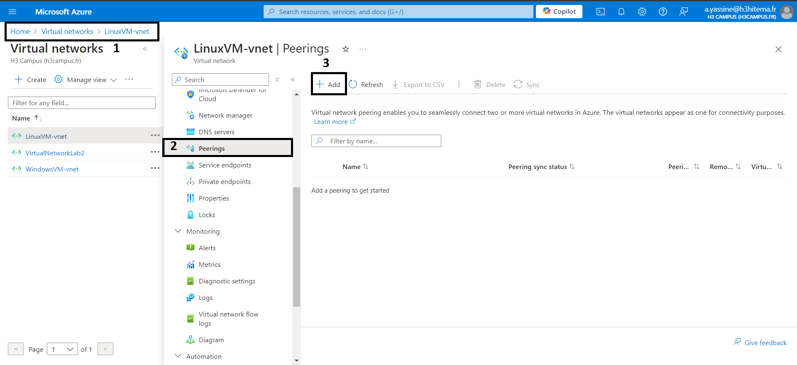

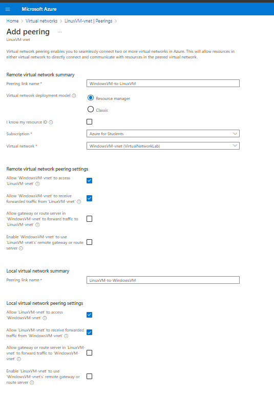

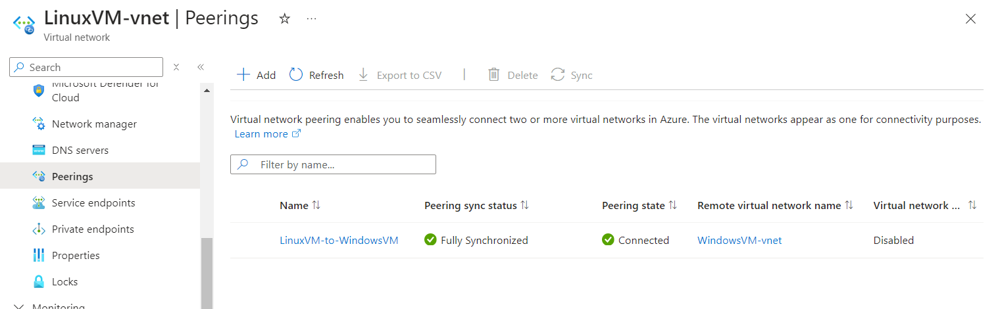

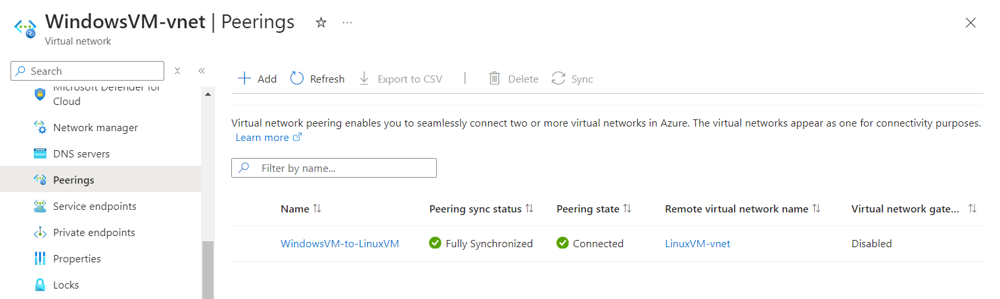

##  5) Remove the VMs, the resources, snapchots and networks 

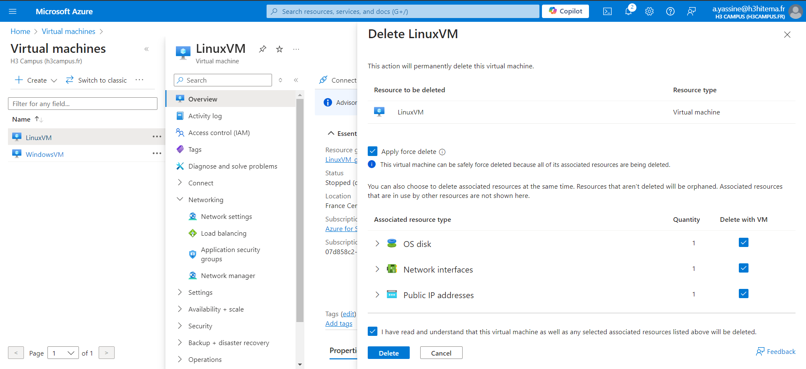

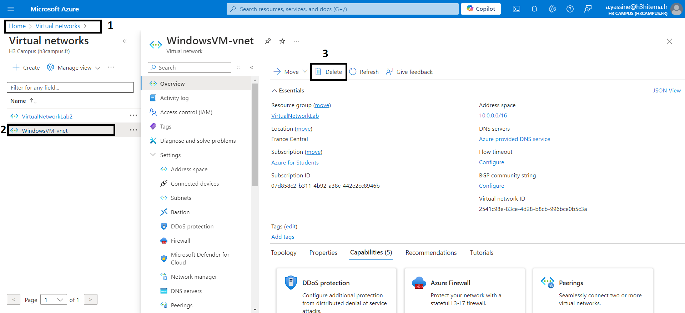

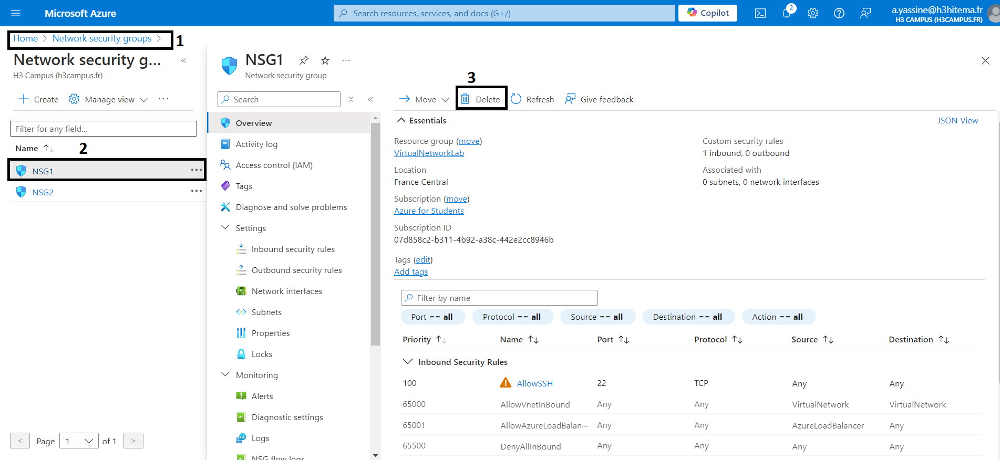

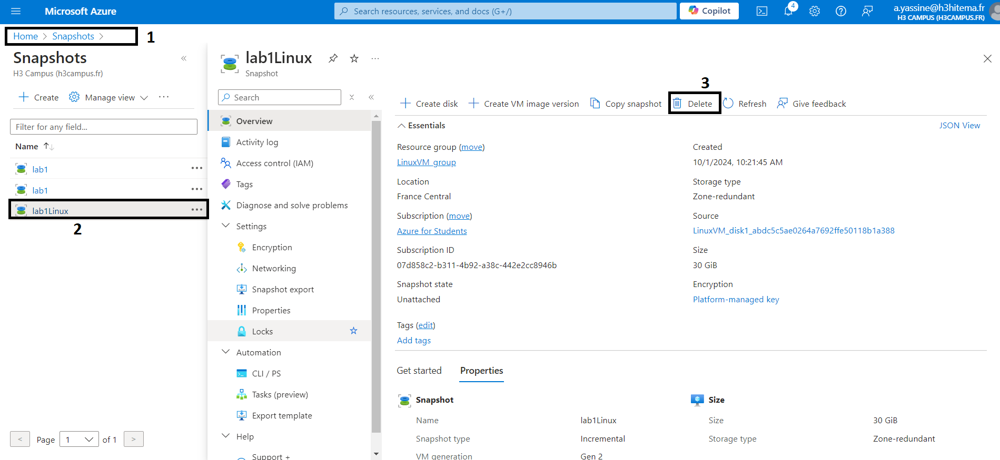